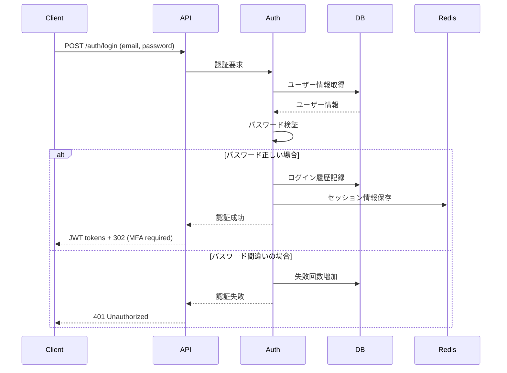
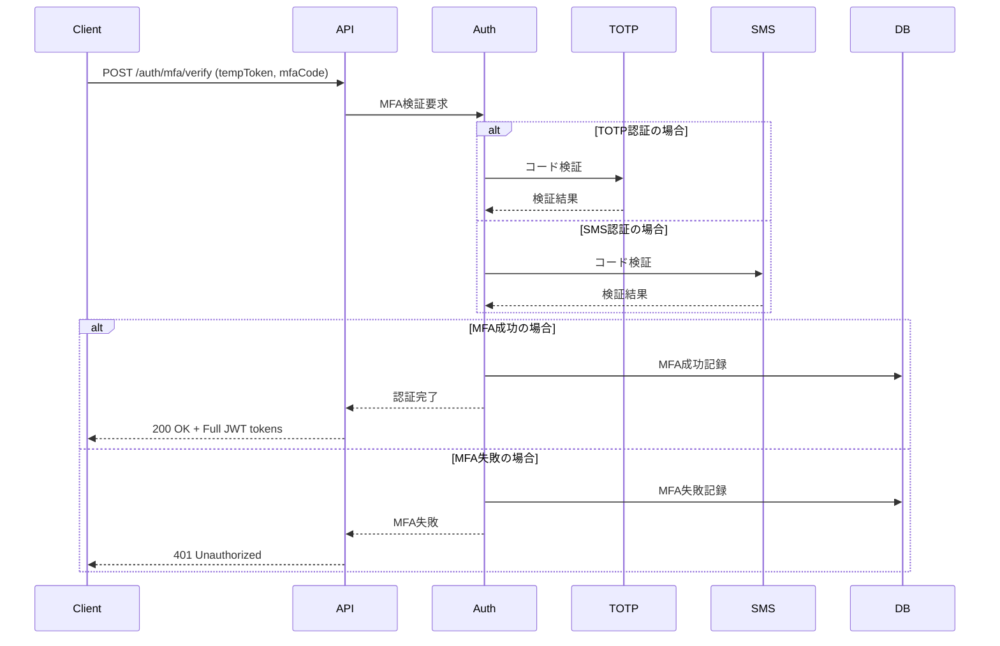
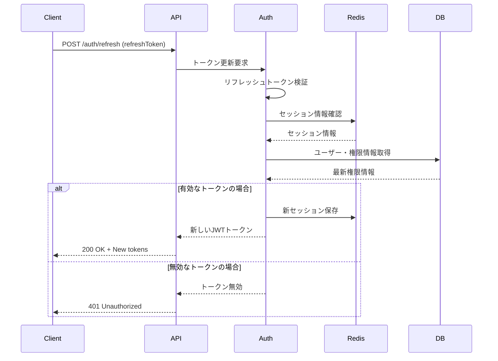

# 認証・認可設計書 - エンジニアスキルシート管理システム

## 1. 認証・認可概要

### 1.1 設計方針
| 項目 | 内容 |
|------|------|
| 認証方式 | JWT (JSON Web Token) + OAuth 2.0 |
| 認可方式 | RBAC (Role-Based Access Control) |
| セッション管理 | ステートレス（JWT）+ Redis（リフレッシュトークン） |
| 多要素認証 | TOTP (Time-based OTP) + SMS |
| パスワードポリシー | NIST準拠 |
| テナント分離 | 企業ID（companyId）による完全分離 |

### 1.2 セキュリティ要件
```yaml
認証強度:
  - パスワード最小長: 12文字
  - 文字種要件: 英大小文字・数字・記号の3種以上
  - 履歴管理: 過去12回分の再利用禁止
  - 有効期限: 90日

アカウントロック:
  - 失敗回数: 10回で段階的ロック
  - ロック期間: 30分 → 2時間 → 管理者解除

セッション管理:
  - アクセストークン有効期限: 8時間
  - リフレッシュトークン有効期限: 30日
  - 非アクティブタイムアウト: 30分
```

## 2. JWT構造設計

### 2.1 アクセストークン構造
```json
{
  "header": {
    "alg": "HS256",
    "typ": "JWT",
    "kid": "key-id-2024-01"
  },
  "payload": {
    "sub": "user_abc123",
    "companyId": "company_xyz789",
    "roles": ["engineer", "sales"],
    "permissions": [
      "engineer.read",
      "engineer.create", 
      "skillsheet.update",
      "approach.send"
    ],
    "userInfo": {
      "name": "田中太郎",
      "email": "tanaka@company.com",
      "companyName": "株式会社サンプル",
      "companyType": "ses"
    },
    "sessionInfo": {
      "sessionId": "session_def456",
      "ipAddress": "192.168.1.100",
      "userAgent": "Mozilla/5.0...",
      "loginMethod": "password_mfa"
    },
    "iat": 1640995200,
    "exp": 1641024000,
    "iss": "engineer-skillsheet-system",
    "aud": "engineer-skillsheet-client",
    "jti": "token_unique_id_123"
  }
}
```

### 2.2 リフレッシュトークン構造
```json
{
  "header": {
    "alg": "HS256",
    "typ": "JWT"
  },
  "payload": {
    "sub": "user_abc123",
    "tokenType": "refresh",
    "sessionId": "session_def456",
    "deviceId": "device_ghi789",
    "iat": 1640995200,
    "exp": 1643587200,
    "iss": "engineer-skillsheet-system"
  }
}
```

## 3. 認証フロー設計

### 3.1 初回ログイン（パスワード認証）


### 3.2 MFA認証フロー


### 3.3 トークン更新フロー


## 4. 認可システム設計

### 4.1 ロール定義
```yaml
# SES企業側ロール
roles:
  admin:
    displayName: "管理者"
    description: "企業内の全権限を持つ"
    permissions: "*"
    
  sales:
    displayName: "営業"
    description: "営業活動・エンジニア管理権限"
    permissions:
      - "engineer.read"
      - "engineer.create"
      - "engineer.update"
      - "skillsheet.read"
      - "project.read"
      - "project.create"
      - "approach.create"
      - "approach.read"
      - "partner.create"
      - "partner.read"
      
  engineer:
    displayName: "エンジニア"
    description: "自身の情報管理権限のみ"
    permissions:
      - "engineer.read.own"
      - "skillsheet.update.own"
      - "project.read.own"

# 取引先企業側ロール
client_roles:
  client_admin:
    displayName: "取引先管理者"
    description: "取引先企業内の管理権限"
    permissions:
      - "engineer.read.allowed"
      - "search.engineer"
      - "approach.request"
      
  client_user:
    displayName: "取引先ユーザー"
    description: "エンジニア閲覧権限のみ"
    permissions:
      - "engineer.read.allowed"
      - "search.engineer"

# フリーランス向けロール
freelance_roles:
  freelancer:
    displayName: "フリーランス"
    description: "自身の情報管理権限"
    permissions:
      - "engineer.read.own"
      - "engineer.update.own"
      - "skillsheet.update.own"
      - "approach.read.own"

# 管理者（運営側）ロール
admin_roles:
  super_admin:
    displayName: "スーパー管理者"
    description: "システム全体の管理権限"
    permissions: "*"
    
  general_admin:
    displayName: "一般管理者"
    description: "顧客企業管理・運営業務"
    permissions:
      - "company.*"
      - "contract.*"
      - "invoice.*"
      - "support.*"
      - "analytics.read"
      
  operator:
    displayName: "オペレーター"
    description: "日常運用・サポート業務"
    permissions:
      - "company.read"
      - "support.*"
      - "maintenance.read"
```

### 4.2 権限定義詳細
```typescript
interface Permission {
  id: string;
  resource: string;  // engineer, skillsheet, project, etc.
  action: string;    // create, read, update, delete
  scope?: string;    // own, company, allowed, all
  conditions?: PermissionCondition[];
}

interface PermissionCondition {
  field: string;     // companyId, userId, status, etc.
  operator: string;  // eq, in, not_in, etc.
  value: any;
}

// 権限例
const permissions = [
  {
    id: "engineer.read.own",
    resource: "engineer", 
    action: "read",
    scope: "own",
    conditions: [
      { field: "userId", operator: "eq", value: "{currentUser.id}" }
    ]
  },
  {
    id: "engineer.read.company", 
    resource: "engineer",
    action: "read", 
    scope: "company",
    conditions: [
      { field: "companyId", operator: "eq", value: "{currentUser.companyId}" }
    ]
  },
  {
    id: "engineer.read.allowed",
    resource: "engineer",
    action: "read",
    scope: "allowed", 
    conditions: [
      { field: "companyId", operator: "in", value: "{allowedCompanies}" },
      { field: "isPublic", operator: "eq", value: true }
    ]
  }
]
```

## 5. テナント分離設計

### 5.1 企業別データ分離
```typescript
// リクエスト処理でのテナント分離
class TenantMiddleware {
  async process(request: Request, response: Response, next: NextFunction) {
    const token = this.extractToken(request);
    const payload = await this.verifyToken(token);
    
    // 企業IDをリクエストコンテキストに設定
    request.context = {
      userId: payload.sub,
      companyId: payload.companyId,
      roles: payload.roles,
      permissions: payload.permissions
    };
    
    // X-Company-IDヘッダーとの整合性チェック
    const headerCompanyId = request.headers['x-company-id'];
    if (headerCompanyId && headerCompanyId !== payload.companyId) {
      throw new ForbiddenError('Company ID mismatch');
    }
    
    next();
  }
}

// データアクセスレイヤーでのテナント分離
class EngineerRepository {
  async findAll(context: RequestContext, filters: any): Promise<Engineer[]> {
    const query = this.queryBuilder
      .select('*')
      .from('engineers')
      .where('company_id', context.companyId); // 強制的にテナント制限
      
    // 追加フィルター適用
    if (filters.status) {
      query.whereIn('current_status', filters.status);
    }
    
    return await query;
  }
}
```

### 5.2 Row Level Security (RLS)
```sql
-- PostgreSQLでのRLS実装例
CREATE POLICY company_isolation_policy ON engineers
    FOR ALL
    TO application_role
    USING (company_id = current_setting('app.current_company_id')::uuid);

-- アプリケーションでの設定
SET app.current_company_id = 'company-uuid-123';
```

## 6. セッション管理設計

### 6.1 Redis セッション構造
```typescript
interface SessionData {
  sessionId: string;
  userId: string;
  companyId: string;
  deviceInfo: {
    deviceId: string;
    userAgent: string;
    ipAddress: string;
    os: string;
    browser: string;
  };
  createdAt: Date;
  lastAccessAt: Date;
  expiresAt: Date;
  isActive: boolean;
  loginMethod: 'password' | 'password_mfa' | 'oauth';
  mfaVerified: boolean;
  refreshTokens: {
    tokenId: string;
    createdAt: Date;
    expiresAt: Date;
    isRevoked: boolean;
  }[];
}

// Redis キー設計
const sessionKeys = {
  session: `session:${sessionId}`,
  userSessions: `user_sessions:${userId}`, // Set of session IDs
  companySessions: `company_sessions:${companyId}`, // Set of session IDs
  refreshToken: `refresh_token:${tokenId}`,
  blacklist: `token_blacklist:${jti}` // 無効化されたトークン
};
```

### 6.2 セッション制限・管理
```typescript
class SessionManager {
  private readonly maxSessionsPerUser = 3;
  private readonly maxSessionsPerCompany = 1000;
  
  async createSession(userId: string, deviceInfo: DeviceInfo): Promise<Session> {
    // 既存セッション数チェック
    await this.enforceSessionLimits(userId);
    
    const session: SessionData = {
      sessionId: generateUUID(),
      userId,
      companyId: await this.getCompanyId(userId),
      deviceInfo,
      createdAt: new Date(),
      lastAccessAt: new Date(),
      expiresAt: new Date(Date.now() + 8 * 60 * 60 * 1000), // 8時間
      isActive: true,
      loginMethod: 'password',
      mfaVerified: false,
      refreshTokens: []
    };
    
    await redis.setex(
      `session:${session.sessionId}`, 
      8 * 60 * 60, // 8時間
      JSON.stringify(session)
    );
    
    await redis.sadd(`user_sessions:${userId}`, session.sessionId);
    
    return session;
  }
  
  async enforceSessionLimits(userId: string): Promise<void> {
    const userSessions = await redis.smembers(`user_sessions:${userId}`);
    
    if (userSessions.length >= this.maxSessionsPerUser) {
      // 最古のセッションを削除
      const oldestSession = await this.findOldestSession(userSessions);
      await this.revokeSession(oldestSession.sessionId);
    }
  }
  
  async validateSession(sessionId: string): Promise<SessionData | null> {
    const sessionData = await redis.get(`session:${sessionId}`);
    if (!sessionData) return null;
    
    const session: SessionData = JSON.parse(sessionData);
    
    // 有効性チェック
    if (!session.isActive || new Date() > session.expiresAt) {
      await this.revokeSession(sessionId);
      return null;
    }
    
    // 最終アクセス時間更新
    session.lastAccessAt = new Date();
    await redis.setex(
      `session:${sessionId}`, 
      8 * 60 * 60,
      JSON.stringify(session)
    );
    
    return session;
  }
}
```

## 7. 多要素認証（MFA）設計

### 7.1 TOTP実装
```typescript
import * as speakeasy from 'speakeasy';

class MFAService {
  async setupTOTP(userId: string): Promise<MFASetupResult> {
    const user = await userRepository.findById(userId);
    
    const secret = speakeasy.generateSecret({
      name: `${user.email} (Engineer Skillsheet)`,
      issuer: 'Engineer Skillsheet System',
      length: 32
    });
    
    // 秘密鍵を暗号化して保存
    await mfaRepository.create({
      userId,
      type: 'totp',
      secretKey: await this.encrypt(secret.base32),
      isEnabled: false, // 検証後に有効化
      backupCodes: await this.generateBackupCodes(userId)
    });
    
    return {
      secret: secret.base32,
      qrCodeUrl: secret.otpauth_url,
      manualEntry: secret.base32,
      backupCodes: await this.generateBackupCodes(userId)
    };
  }
  
  async verifyTOTP(userId: string, token: string): Promise<boolean> {
    const mfaConfig = await mfaRepository.findByUserId(userId);
    if (!mfaConfig || mfaConfig.type !== 'totp') {
      return false;
    }
    
    const secretKey = await this.decrypt(mfaConfig.secretKey);
    
    const verified = speakeasy.totp.verify({
      secret: secretKey,
      encoding: 'base32',
      token,
      window: 2, // ±60秒の許容時間差
      time: Math.floor(Date.now() / 1000)
    });
    
    if (verified) {
      // 使用済みトークンの記録（リプレイ攻撃防止）
      await this.recordUsedToken(userId, token, Date.now());
    }
    
    return verified;
  }
  
  private async generateBackupCodes(userId: string): Promise<string[]> {
    const codes = Array.from({ length: 10 }, () => 
      Math.random().toString(36).substring(2, 10).toUpperCase()
    );
    
    const hashedCodes = await Promise.all(
      codes.map(code => bcrypt.hash(code, 12))
    );
    
    await backupCodeRepository.create({
      userId,
      codes: hashedCodes,
      createdAt: new Date()
    });
    
    return codes;
  }
}
```

### 7.2 SMS認証実装
```typescript
class SMSMFAService {
  async sendSMSCode(userId: string, phoneNumber: string): Promise<void> {
    const code = this.generateSixDigitCode();
    const expiresAt = new Date(Date.now() + 5 * 60 * 1000); // 5分後
    
    // コード保存
    await redis.setex(
      `sms_mfa:${userId}`,
      300, // 5分
      JSON.stringify({ code: await bcrypt.hash(code, 10), expiresAt })
    );
    
    // SMS送信（外部サービス連携）
    await this.smsProvider.send({
      to: phoneNumber,
      message: `認証コード: ${code} (5分間有効)`
    });
    
    // 送信ログ記録
    await smsLogRepository.create({
      userId,
      phoneNumber: this.maskPhoneNumber(phoneNumber),
      sentAt: new Date(),
      purpose: 'mfa_verification'
    });
  }
  
  async verifySMSCode(userId: string, inputCode: string): Promise<boolean> {
    const storedData = await redis.get(`sms_mfa:${userId}`);
    if (!storedData) return false;
    
    const { code, expiresAt } = JSON.parse(storedData);
    
    if (new Date() > new Date(expiresAt)) {
      await redis.del(`sms_mfa:${userId}`);
      return false;
    }
    
    const verified = await bcrypt.compare(inputCode, code);
    
    if (verified) {
      await redis.del(`sms_mfa:${userId}`);
    }
    
    return verified;
  }
  
  private generateSixDigitCode(): string {
    return Math.floor(100000 + Math.random() * 900000).toString();
  }
}
```

## 8. セキュリティ監視・異常検知

### 8.1 ログイン異常検知
```typescript
class SecurityMonitor {
  async detectAnomalousLogin(userId: string, loginAttempt: LoginAttempt): Promise<SecurityAlert[]> {
    const alerts: SecurityAlert[] = [];
    const recentLogins = await this.getRecentLogins(userId, 24); // 24時間
    
    // 地理的異常検知
    if (await this.isGeographicallyAnomalous(loginAttempt, recentLogins)) {
      alerts.push({
        type: 'geographical_anomaly',
        severity: 'high',
        details: {
          currentLocation: loginAttempt.location,
          recentLocations: recentLogins.map(l => l.location)
        }
      });
    }
    
    // デバイス異常検知
    if (await this.isNewDevice(loginAttempt, userId)) {
      alerts.push({
        type: 'new_device',
        severity: 'medium',
        details: {
          deviceFingerprint: loginAttempt.deviceFingerprint,
          userAgent: loginAttempt.userAgent
        }
      });
    }
    
    // 時間帯異常検知
    if (await this.isUnusualTime(loginAttempt, recentLogins)) {
      alerts.push({
        type: 'unusual_time',
        severity: 'low',
        details: {
          currentTime: loginAttempt.timestamp,
          usualTimes: this.extractUsualLoginTimes(recentLogins)
        }
      });
    }
    
    return alerts;
  }
  
  async handleSecurityAlerts(userId: string, alerts: SecurityAlert[]): Promise<void> {
    for (const alert of alerts) {
      // アラート記録
      await securityAlertRepository.create({
        userId,
        type: alert.type,
        severity: alert.severity,
        details: alert.details,
        createdAt: new Date()
      });
      
      // 高度な脅威の場合は追加認証要求
      if (alert.severity === 'high') {
        await this.requireAdditionalVerification(userId);
      }
      
      // 通知送信
      await this.notifySecurityTeam(alert);
      if (alert.severity !== 'low') {
        await this.notifyUser(userId, alert);
      }
    }
  }
}
```

### 8.2 ブルートフォース攻撃対策
```typescript
class BruteForceProtection {
  private readonly maxAttempts = 10;
  private readonly lockoutDuration = [30 * 60, 2 * 60 * 60, 24 * 60 * 60]; // 秒
  
  async recordFailedAttempt(identifier: string, type: 'user' | 'ip'): Promise<LockoutInfo> {
    const key = `failed_attempts:${type}:${identifier}`;
    const attempts = await redis.incr(key);
    
    if (attempts === 1) {
      await redis.expire(key, 24 * 60 * 60); // 24時間のウィンドウ
    }
    
    const lockoutInfo = await this.calculateLockout(attempts);
    
    if (lockoutInfo.shouldLock) {
      await this.applyLockout(identifier, type, lockoutInfo);
    }
    
    return lockoutInfo;
  }
  
  private async calculateLockout(attempts: number): Promise<LockoutInfo> {
    if (attempts >= this.maxAttempts) {
      const lockLevel = Math.min(
        Math.floor((attempts - this.maxAttempts) / this.maxAttempts),
        this.lockoutDuration.length - 1
      );
      
      return {
        shouldLock: true,
        duration: this.lockoutDuration[lockLevel],
        level: lockLevel + 1,
        attempts
      };
    }
    
    return {
      shouldLock: false,
      remainingAttempts: this.maxAttempts - attempts,
      attempts
    };
  }
  
  private async applyLockout(identifier: string, type: string, lockoutInfo: LockoutInfo): Promise<void> {
    const lockKey = `lockout:${type}:${identifier}`;
    
    await redis.setex(lockKey, lockoutInfo.duration, JSON.stringify({
      lockedAt: Date.now(),
      duration: lockoutInfo.duration,
      level: lockoutInfo.level,
      attempts: lockoutInfo.attempts
    }));
    
    // 高レベルロックアウトの場合は管理者通知
    if (lockoutInfo.level >= 3) {
      await this.notifyAdministrators({
        type: 'high_level_lockout',
        identifier,
        identifierType: type,
        level: lockoutInfo.level,
        attempts: lockoutInfo.attempts
      });
    }
  }
}
```

## 9. API認証ミドルウェア

### 9.1 認証ミドルウェア実装
```typescript
class AuthenticationMiddleware {
  async authenticate(req: Request, res: Response, next: NextFunction) {
    try {
      const token = this.extractToken(req);
      if (!token) {
        throw new UnauthorizedError('Access token required');
      }
      
      // トークン検証
      const payload = await this.verifyToken(token);
      
      // ブラックリストチェック
      if (await this.isTokenBlacklisted(payload.jti)) {
        throw new UnauthorizedError('Token has been revoked');
      }
      
      // セッション検証
      const session = await sessionManager.validateSession(payload.sessionId);
      if (!session) {
        throw new UnauthorizedError('Invalid session');
      }
      
      // ユーザー有効性チェック
      const user = await userRepository.findById(payload.sub);
      if (!user || !user.isActive) {
        throw new UnauthorizedError('User account is not active');
      }
      
      // リクエストコンテキスト設定
      req.user = {
        id: payload.sub,
        companyId: payload.companyId,
        roles: payload.roles,
        permissions: payload.permissions,
        session: session
      };
      
      next();
    } catch (error) {
      if (error instanceof UnauthorizedError) {
        res.status(401).json({ error: error.message });
      } else {
        res.status(500).json({ error: 'Authentication failed' });
      }
    }
  }
  
  private extractToken(req: Request): string | null {
    const authHeader = req.headers.authorization;
    if (!authHeader || !authHeader.startsWith('Bearer ')) {
      return null;
    }
    return authHeader.substring(7);
  }
  
  private async verifyToken(token: string): Promise<JWTPayload> {
    try {
      const payload = jwt.verify(token, process.env.JWT_SECRET) as JWTPayload;
      
      // 基本的な検証
      if (!payload.sub || !payload.companyId || !payload.exp) {
        throw new Error('Invalid token structure');
      }
      
      // 有効期限チェック
      if (Date.now() >= payload.exp * 1000) {
        throw new Error('Token expired');
      }
      
      return payload;
    } catch (error) {
      throw new UnauthorizedError('Invalid token');
    }
  }
}
```

### 9.2 認可ミドルウェア実装
```typescript
class AuthorizationMiddleware {
  requirePermissions(...requiredPermissions: string[]) {
    return (req: Request, res: Response, next: NextFunction) => {
      if (!req.user) {
        return res.status(401).json({ error: 'Authentication required' });
      }
      
      const hasAllPermissions = requiredPermissions.every(permission => 
        this.hasPermission(req.user, permission, req)
      );
      
      if (!hasAllPermissions) {
        return res.status(403).json({ 
          error: 'Insufficient permissions',
          required: requiredPermissions,
          current: req.user.permissions
        });
      }
      
      next();
    };
  }
  
  requireRoles(...requiredRoles: string[]) {
    return (req: Request, res: Response, next: NextFunction) => {
      if (!req.user) {
        return res.status(401).json({ error: 'Authentication required' });
      }
      
      const hasRequiredRole = requiredRoles.some(role => 
        req.user.roles.includes(role)
      );
      
      if (!hasRequiredRole) {
        return res.status(403).json({ 
          error: 'Insufficient role',
          required: requiredRoles,
          current: req.user.roles
        });
      }
      
      next();
    };
  }
  
  requireResourceAccess(resourceType: string, resourceIdParam?: string) {
    return (req: Request, res: Response, next: NextFunction) => {
      if (!req.user) {
        return res.status(401).json({ error: 'Authentication required' });
      }
      
      // リソース所有者チェック
      if (resourceIdParam) {
        const resourceId = req.params[resourceIdParam];
        if (!this.canAccessResource(req.user, resourceType, resourceId, req)) {
          return res.status(403).json({ error: 'Resource access denied' });
        }
      }
      
      next();
    };
  }
  
  private hasPermission(user: AuthenticatedUser, permission: string, req: Request): boolean {
    // ワイルドカード権限チェック
    if (user.permissions.includes('*')) {
      return true;
    }
    
    // 直接権限マッチ
    if (user.permissions.includes(permission)) {
      return true;
    }
    
    // 動的権限チェック（.own, .company等）
    return this.checkDynamicPermission(user, permission, req);
  }
  
  private checkDynamicPermission(user: AuthenticatedUser, permission: string, req: Request): boolean {
    const [resource, action, scope] = permission.split('.');
    
    switch (scope) {
      case 'own':
        // 自分のリソースのみアクセス可能
        const resourceId = req.params.id || req.params.userId || req.params.engineerId;
        return resourceId === user.id;
        
      case 'company':
        // 同じ企業のリソースにアクセス可能
        return this.belongsToSameCompany(req, user);
        
      default:
        return user.permissions.includes(`${resource}.${action}`);
    }
  }
}
```

この認証・認可設計書により、セキュアで拡張性のある認証システムを構築し、適切なアクセス制御を実現できます。