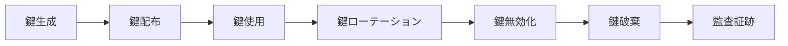
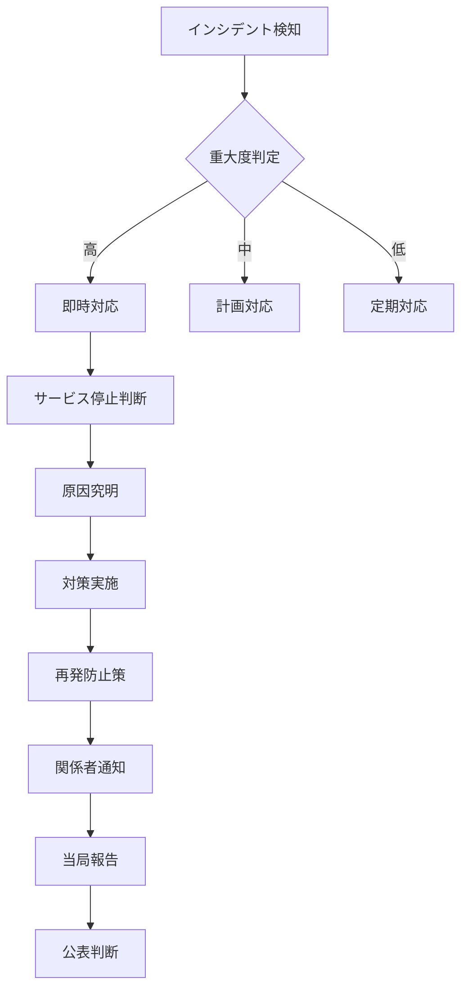

# 個人情報保護設計書 - エンジニアスキルシート管理システム

## 1. 概要

### 1.1 目的
本設計書は、エンジニアスキルシート管理システムにおける個人情報の保護に関する技術的実装方針を定義し、個人情報保護法およびGDPR等の各種規制に準拠したシステム設計を実現することを目的とする。

### 1.2 適用範囲
- システム内で取り扱う全ての個人情報
- 個人情報の収集、利用、保管、廃棄の全ライフサイクル
- 本番環境、ステージング環境、開発環境の全環境

### 1.3 参照規格・ガイドライン
- 個人情報保護法（令和5年改正版）
- JIS Q 15001（個人情報保護マネジメントシステム）
- ISO/IEC 27001/27002
- NIST SP 800-57（暗号鍵管理）
- OWASP セキュリティガイドライン

## 2. 個人情報の定義と分類

### 2.1 個人情報の定義
本システムにおける個人情報を以下のように定義する：

| 分類 | 項目 | 機密レベル |
|------|------|------------|
| **基本個人情報** | 氏名、生年月日、性別、住所 | 高 |
| **連絡先情報** | メールアドレス、電話番号 | 高 |
| **認証情報** | パスワード、セッショントークン | 極高 |
| **職務情報** | 社員番号、部署、役職 | 中 |
| **スキル情報** | 技術スキル、資格、経歴 | 中 |
| **金融情報** | 給与情報、銀行口座（フリーランス） | 極高 |
| **アクセス情報** | IPアドレス、アクセスログ | 低 |

### 2.2 センシティブ情報の特定
特に慎重な取り扱いが必要な情報：
- マイナンバー（取り扱わない設計とする）
- 健康情報（取り扱わない設計とする）
- 金融機関情報（フリーランスの振込先情報のみ）

## 3. 暗号化設計

### 3.1 暗号化アルゴリズム仕様

#### 3.1.1 保存時暗号化（Encryption at Rest）
```yaml
データベース暗号化:
  アルゴリズム: AES-256-GCM
  モード: GCM (Galois/Counter Mode)
  鍵長: 256ビット
  実装: 
    - PostgreSQL Transparent Data Encryption (TDE)
    - カラムレベル暗号化（個人情報カラム）

ファイルストレージ暗号化:
  アルゴリズム: AES-256-CTR
  実装: AWS S3 Server-Side Encryption (SSE-S3)
  鍵管理: AWS KMS

バックアップ暗号化:
  アルゴリズム: AES-256-CBC
  鍵: 専用バックアップ鍵（定期ローテーション）
```

#### 3.1.2 転送時暗号化（Encryption in Transit）
```yaml
HTTPS/TLS:
  プロトコル: TLS 1.3以上
  暗号スイート:
    - TLS_AES_256_GCM_SHA384
    - TLS_CHACHA20_POLY1305_SHA256
    - TLS_AES_128_GCM_SHA256
  証明書: EV SSL証明書
  HSTS: max-age=31536000; includeSubDomains; preload

API間通信:
  プロトコル: mTLS (mutual TLS)
  証明書: 内部CA発行のクライアント証明書
```

#### 3.1.3 アプリケーションレベル暗号化
```typescript
// 暗号化実装例
import crypto from 'crypto';

class PersonalDataEncryption {
  private algorithm = 'aes-256-gcm';
  private keyDerivation = 'pbkdf2';
  private iterations = 100000;
  private saltLength = 32;
  private tagLength = 16;
  private ivLength = 16;

  // 個人情報の暗号化
  async encryptPersonalData(data: string, masterKey: string): Promise<EncryptedData> {
    const salt = crypto.randomBytes(this.saltLength);
    const iv = crypto.randomBytes(this.ivLength);
    
    // 鍵導出
    const key = crypto.pbkdf2Sync(
      masterKey, 
      salt, 
      this.iterations, 
      32, 
      'sha256'
    );
    
    // 暗号化
    const cipher = crypto.createCipheriv(this.algorithm, key, iv);
    const encrypted = Buffer.concat([
      cipher.update(data, 'utf8'),
      cipher.final()
    ]);
    
    const tag = cipher.getAuthTag();
    
    return {
      encrypted: encrypted.toString('base64'),
      salt: salt.toString('base64'),
      iv: iv.toString('base64'),
      tag: tag.toString('base64'),
      algorithm: this.algorithm,
      iterations: this.iterations
    };
  }

  // 個人情報の復号
  async decryptPersonalData(
    encryptedData: EncryptedData, 
    masterKey: string
  ): Promise<string> {
    const salt = Buffer.from(encryptedData.salt, 'base64');
    const iv = Buffer.from(encryptedData.iv, 'base64');
    const tag = Buffer.from(encryptedData.tag, 'base64');
    const encrypted = Buffer.from(encryptedData.encrypted, 'base64');
    
    // 鍵導出
    const key = crypto.pbkdf2Sync(
      masterKey,
      salt,
      encryptedData.iterations,
      32,
      'sha256'
    );
    
    // 復号
    const decipher = crypto.createDecipheriv(this.algorithm, key, iv);
    decipher.setAuthTag(tag);
    
    const decrypted = Buffer.concat([
      decipher.update(encrypted),
      decipher.final()
    ]);
    
    return decrypted.toString('utf8');
  }
}
```

### 3.2 暗号鍵管理

#### 3.2.1 鍵管理アーキテクチャ
```yaml
マスターキー管理:
  保管場所: AWS KMS / Azure Key Vault
  ローテーション: 年次（自動）
  アクセス制御: IAMロールベース

データ暗号化鍵（DEK）:
  生成: マスターキーから派生
  保管: 暗号化してデータベースに保存
  ローテーション: 四半期ごと

セッション鍵:
  生成: セッション開始時
  保管: メモリ内のみ
  有効期限: 24時間
```

#### 3.2.2 鍵のライフサイクル管理


## 4. データマスキング設計

### 4.1 マスキングルール定義

#### 4.1.1 表示時マスキング
```yaml
氏名:
  ルール: 姓の1文字目以外を伏字
  例: "田中太郎" → "田○○○"
  適用: 一覧画面、検索結果

メールアドレス:
  ルール: @前の3文字目以降を伏字
  例: "tanaka@example.com" → "ta****@example.com"
  適用: 管理画面、ログ

電話番号:
  ルール: 下4桁以外を伏字
  例: "090-1234-5678" → "***-****-5678"
  適用: 一覧画面、エクスポート時

住所:
  ルール: 市区町村以降を伏字
  例: "東京都渋谷区道玄坂1-2-3" → "東京都渋谷区********"
  適用: 詳細画面（権限による）

生年月日:
  ルール: 年齢のみ表示
  例: "1990-01-15" → "34歳"
  適用: スキルシート公開時
```

#### 4.1.2 ログ・監査証跡のマスキング
```typescript
// マスキング実装例
class DataMasking {
  // 動的マスキング
  maskPersonalData(data: any, userRole: string): any {
    const maskedData = { ...data };
    
    // 役割に応じたマスキングルール適用
    const maskingRules = this.getMaskingRules(userRole);
    
    for (const [field, rule] of Object.entries(maskingRules)) {
      if (maskedData[field]) {
        maskedData[field] = this.applyMaskingRule(
          maskedData[field], 
          rule
        );
      }
    }
    
    return maskedData;
  }

  // マスキングルール取得
  private getMaskingRules(role: string): MaskingRules {
    const rules: { [key: string]: MaskingRules } = {
      'guest': {
        name: 'partial',
        email: 'full',
        phone: 'full',
        address: 'full',
        birthDate: 'age_only'
      },
      'client': {
        name: 'none',
        email: 'partial',
        phone: 'partial',
        address: 'partial',
        birthDate: 'age_only'
      },
      'admin': {
        name: 'none',
        email: 'none',
        phone: 'none',
        address: 'none',
        birthDate: 'none'
      }
    };
    
    return rules[role] || rules['guest'];
  }

  // マスキング適用
  private applyMaskingRule(value: string, rule: string): string {
    switch (rule) {
      case 'full':
        return '*'.repeat(value.length);
      case 'partial':
        return this.partialMask(value);
      case 'age_only':
        return this.calculateAge(value) + '歳';
      case 'none':
        return value;
      default:
        return '*****';
    }
  }
}
```

### 4.2 環境別マスキング設定

#### 4.2.1 開発・テスト環境
```yaml
開発環境:
  個人情報: 全てダミーデータに置換
  置換ルール:
    - 氏名: テストユーザー[連番]
    - メール: test[連番]@example.com
    - 電話: 090-0000-[連番]

ステージング環境:
  個人情報: 本番データをマスキング処理
  保持期間: 30日（自動削除）
```

## 5. 個人情報アクセスログ設計

### 5.1 アクセスログ仕様

#### 5.1.1 ログ記録項目
```typescript
interface PersonalDataAccessLog {
  // 基本情報
  logId: string;                    // ログID（UUID）
  timestamp: Date;                  // アクセス日時
  
  // アクセス者情報
  userId: string;                   // ユーザーID
  userName: string;                 // ユーザー名（マスキング済）
  userRole: string;                 // ユーザーロール
  companyId: string;                // 企業ID
  
  // アクセス対象
  targetUserId?: string;            // 対象ユーザーID
  targetDataType: string;           // データ種別
  targetFields: string[];           // アクセスフィールド
  
  // アクセス詳細
  accessType: 'read' | 'write' | 'delete' | 'export';
  accessMethod: string;             // API/画面
  accessReason?: string;            // アクセス理由
  
  // 技術情報
  ipAddress: string;                // IPアドレス
  userAgent: string;                // ユーザーエージェント
  sessionId: string;                // セッションID
  requestId: string;                // リクエストID
  
  // 結果
  result: 'success' | 'failure' | 'partial';
  errorCode?: string;               // エラーコード
  responseTime: number;             // レスポンス時間（ms）
}
```

#### 5.1.2 ログ記録実装
```typescript
// アクセスログ記録サービス
class PersonalDataAccessLogger {
  async logAccess(context: AccessContext): Promise<void> {
    const log: PersonalDataAccessLog = {
      logId: generateUUID(),
      timestamp: new Date(),
      userId: context.user.id,
      userName: this.maskUserName(context.user.name),
      userRole: context.user.role,
      companyId: context.user.companyId,
      targetUserId: context.targetUserId,
      targetDataType: context.dataType,
      targetFields: context.fields,
      accessType: context.accessType,
      accessMethod: context.method,
      accessReason: context.reason,
      ipAddress: this.hashIpAddress(context.ipAddress),
      userAgent: context.userAgent,
      sessionId: context.sessionId,
      requestId: context.requestId,
      result: context.result,
      errorCode: context.errorCode,
      responseTime: context.responseTime
    };
    
    // 非同期でログ記録（パフォーマンスへの影響を最小化）
    await this.writeLogAsync(log);
    
    // 異常アクセス検知
    if (this.isAnomalousAccess(log)) {
      await this.alertSecurityTeam(log);
    }
  }

  // 異常アクセス検知
  private isAnomalousAccess(log: PersonalDataAccessLog): boolean {
    // 大量アクセス検知
    if (await this.checkBulkAccess(log.userId)) {
      return true;
    }
    
    // 通常外時間アクセス
    if (this.isOutsideBusinessHours(log.timestamp)) {
      return true;
    }
    
    // 権限外アクセス
    if (!this.hasPermission(log.userRole, log.targetDataType)) {
      return true;
    }
    
    return false;
  }
}
```

### 5.2 ログ分析とレポート

#### 5.2.1 定期分析レポート
```yaml
日次レポート:
  - アクセス総数
  - ユーザー別アクセス数TOP10
  - 異常アクセス検知数
  - エラー発生状況

週次レポート:
  - データ種別アクセス傾向
  - 時間帯別アクセス分析
  - 権限外アクセス試行

月次レポート:
  - 全体アクセストレンド
  - コンプライアンス違反検出
  - セキュリティインシデント総括
```

## 6. 個人情報の安全管理措置

### 6.1 技術的安全管理措置

#### 6.1.1 アクセス制御
```yaml
認証強化:
  - 多要素認証（MFA）必須
  - パスワードポリシー
    - 最小12文字
    - 大小英数字記号混在
    - 90日ごと変更
    - 過去5回の再利用禁止

権限管理:
  - 最小権限の原則
  - 定期的な権限見直し（四半期）
  - 特権アカウント管理
  - Just-In-Time (JIT) アクセス

ネットワーク分離:
  - 個人情報処理系の分離
  - VPN必須化
  - IPアドレス制限
```

#### 6.1.2 不正アクセス防止
```typescript
// 不正アクセス検知システム
class SecurityMonitor {
  // リアルタイム監視
  async monitorAccess(request: Request): Promise<void> {
    // レート制限チェック
    if (await this.checkRateLimit(request)) {
      throw new RateLimitExceededError();
    }
    
    // 異常パターン検知
    if (await this.detectAnomalousPattern(request)) {
      await this.blockAccess(request);
      await this.notifySecurityTeam(request);
    }
    
    // 地理的異常検知
    if (await this.detectGeographicalAnomaly(request)) {
      await this.requireAdditionalAuth(request);
    }
  }

  // SQLインジェクション対策
  sanitizeInput(input: string): string {
    // パラメータ化クエリの使用を強制
    // 入力値検証とサニタイズ
    return sanitized;
  }
}
```

### 6.2 物理的安全管理措置

#### 6.2.1 データセンター要件
```yaml
設備要件:
  - ISO 27001認証取得施設
  - 24時間365日有人監視
  - 生体認証による入退室管理
  - 監視カメラ完全録画

環境制御:
  - 冗長電源システム
  - 温度・湿度管理
  - 火災検知・消火システム
  - 耐震・免震構造
```

### 6.3 組織的安全管理措置

#### 6.3.1 体制・規程
```yaml
管理体制:
  - 個人情報保護管理者の設置
  - 定期監査（年2回）
  - インシデント対応チーム

規程・手順:
  - 個人情報保護規程
  - アクセス管理手順書
  - インシデント対応手順書
  - 廃棄手順書
```

## 7. データライフサイクル管理

### 7.1 個人情報の収集
```yaml
収集原則:
  - 利用目的の明示
  - 必要最小限の収集
  - 本人同意の取得

収集時の暗号化:
  - HTTPS必須
  - フォーム送信時の暗号化
```

### 7.2 個人情報の利用
```yaml
利用制限:
  - 目的外利用の禁止
  - アクセス権限による制御
  - 利用ログの記録
```

### 7.3 個人情報の保管
```yaml
保管期間:
  アクティブデータ: 契約期間中
  非アクティブデータ: 契約終了後1年
  バックアップ: 7年（法定保存期間）
  ログデータ: 3年

保管時の措置:
  - 暗号化保存
  - 定期的な棚卸し
  - 不要データの削除
```

### 7.4 個人情報の廃棄
```typescript
// 安全な廃棄処理
class SecureDataDeletion {
  async deletePersonalData(userId: string): Promise<void> {
    // 論理削除
    await this.logicalDelete(userId);
    
    // 匿名化処理
    await this.anonymizeData(userId);
    
    // 物理削除（バッチ処理）
    await this.schedulePhysicalDeletion(userId);
    
    // 削除証明書の生成
    const certificate = await this.generateDeletionCertificate(userId);
    
    // 監査ログ記録
    await this.auditLog({
      action: 'personal_data_deletion',
      userId: userId,
      certificate: certificate,
      timestamp: new Date()
    });
  }

  // 完全削除（復元不可能）
  private async secureWipe(data: Buffer): Promise<void> {
    // DoD 5220.22-M 標準による上書き
    for (let i = 0; i < 3; i++) {
      await this.overwriteWithPattern(data, 0x00);
      await this.overwriteWithPattern(data, 0xFF);
      await this.overwriteWithRandom(data);
    }
  }
}
```

## 8. インシデント対応

### 8.1 インシデント検知
```yaml
検知方法:
  - 自動監視アラート
  - 定期監査
  - 内部通報
  - 外部指摘

検知時の初動:
  - 15分以内: 一次評価
  - 30分以内: 対策本部設置
  - 1時間以内: 影響範囲特定
```

### 8.2 インシデント対応フロー


### 8.3 個人情報漏洩時の対応
```yaml
72時間以内の対応:
  - 個人情報保護委員会への報告
  - 本人への通知
  - 二次被害防止措置

対応内容:
  - 漏洩範囲の特定
  - 被害の最小化
  - 原因究明と対策
  - 再発防止策の実施
```

## 9. 監査とコンプライアンス

### 9.1 定期監査
```yaml
内部監査:
  頻度: 四半期
  対象:
    - アクセス権限の棚卸し
    - ログ分析
    - 暗号化状態確認
    - マスキング動作確認

外部監査:
  頻度: 年次
  対象:
    - セキュリティ診断
    - ペネトレーションテスト
    - コンプライアンス監査
```

### 9.2 改善活動
```yaml
PDCA サイクル:
  Plan: リスク評価と対策立案
  Do: 対策の実施
  Check: 効果測定と監査
  Act: 改善と標準化
```

## 10. 開発者向けガイドライン

### 10.1 セキュアコーディング
```typescript
// 個人情報を扱う際の実装例
class PersonalDataHandler {
  // ❌ 悪い例：平文でログ出力
  badExample(user: User) {
    console.log(`User data: ${JSON.stringify(user)}`);
  }
  
  // ⭕ 良い例：マスキングしてログ出力
  goodExample(user: User) {
    const maskedUser = this.maskingService.mask(user);
    this.logger.info('User data accessed', { 
      userId: user.id,
      maskedData: maskedUser 
    });
  }
  
  // ⭕ 個人情報の一時保存は暗号化
  async temporaryStore(data: PersonalData): Promise<void> {
    const encrypted = await this.encrypt(data);
    await this.cache.set(key, encrypted, { ttl: 300 }); // 5分で自動削除
  }
}
```

### 10.2 テスト環境での注意事項
```yaml
禁止事項:
  - 本番データのコピー使用
  - 個人情報のハードコーディング
  - テストログへの個人情報出力

推奨事項:
  - ダミーデータジェネレーターの使用
  - マスキング機能の単体テスト
  - セキュリティテストの自動化
```

## 11. 付録

### 11.1 用語定義
- **個人情報**: 生存する個人に関する情報で、特定の個人を識別できるもの
- **要配慮個人情報**: 人種、信条、病歴等の慎重な取り扱いが必要な情報
- **仮名加工情報**: 他の情報と照合しない限り特定の個人を識別できないよう加工した情報
- **匿名加工情報**: 特定の個人を識別できないよう不可逆的に加工した情報

### 11.2 参考資料
- 個人情報保護委員会ガイドライン
- OWASP Top 10
- CIS Controls
- NIST Cybersecurity Framework

### 11.3 改訂履歴
| 版数 | 日付 | 改訂内容 | 承認者 |
|------|------|----------|--------|
| 1.0 | 2024-XX-XX | 初版作成 | - |