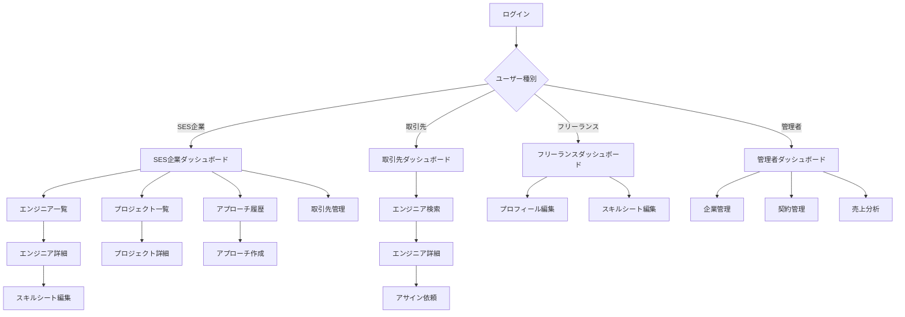

# 画面設計書 - エンジニアスキルシート管理システム

## 1. 画面設計概要

### 1.1 設計方針
| 項目 | 内容 |
|------|------|
| デザインシステム | Material Design 3準拠 |
| カラーパレット | プライマリ: #1976d2, セカンダリ: #dc004e |
| タイポグラフィ | Noto Sans JP（日本語対応） |
| レスポンシブ対応 | モバイルファースト設計 |
| アクセシビリティ | WCAG 2.1 AA準拠 |
| 多言語対応 | 日本語のみ |

### 1.2 ブレークポイント
```scss
$breakpoints: (
  xs: 0px,      // スマートフォン (375px~)
  sm: 600px,    // 小型タブレット
  md: 900px,    // タブレット
  lg: 1200px,   // デスクトップ
  xl: 1536px    // 大型デスクトップ
);
```

### 1.3 共通デザイントークン
```scss
// スペーシング
$spacing: (
  xs: 4px,
  sm: 8px,
  md: 16px,
  lg: 24px,
  xl: 32px,
  xxl: 48px
);

// 角丸
$border-radius: (
  sm: 4px,
  md: 8px,
  lg: 12px,
  xl: 16px
);

// シャドウ
$shadows: (
  sm: 0 1px 3px rgba(0,0,0,0.12),
  md: 0 4px 6px rgba(0,0,0,0.12),
  lg: 0 10px 15px rgba(0,0,0,0.12)
);
```

## 2. 画面一覧・遷移図

### 2.1 全体画面構成
```
エンジニアスキルシート管理システム
├── 認証系画面
│   ├── AUTH001 - ログイン画面
│   ├── AUTH002 - ユーザー登録画面
│   ├── AUTH003 - パスワードリセット画面
│   └── AUTH004 - MFA設定画面
├── SES企業向け画面
│   ├── DASH001 - ダッシュボード
│   ├── ENG001 - エンジニア一覧
│   ├── ENG002 - エンジニア詳細
│   ├── ENG003 - エンジニア登録・編集
│   ├── SKL001 - スキルシート一覧
│   ├── SKL002 - スキルシート詳細・編集
│   ├── PRJ001 - プロジェクト一覧
│   ├── PRJ002 - プロジェクト詳細
│   ├── PRJ003 - プロジェクト登録・編集
│   ├── APP001 - アプローチ履歴
│   ├── APP002 - アプローチ作成
│   ├── BIZ001 - 取引先管理
│   ├── BIZ002 - 取引先詳細
│   ├── SRC001 - エンジニア検索
│   └── SET001 - 設定画面
├── 取引先向け画面
│   ├── CLI001 - 取引先ダッシュボード
│   ├── CLI002 - エンジニア検索（取引先用）
│   ├── CLI003 - エンジニア詳細（取引先用）
│   └── CLI004 - アサイン依頼
├── フリーランス向け画面
│   ├── FRL001 - フリーランスダッシュボード
│   ├── FRL002 - プロフィール編集
│   ├── FRL003 - スキルシート編集
│   └── FRL004 - アプローチ履歴
├── 管理者向け画面
│   ├── ADM001 - 管理者ダッシュボード
│   ├── ADM002 - 企業管理
│   ├── ADM003 - 契約管理
│   ├── ADM004 - 請求管理
│   ├── ADM005 - 売上分析
│   ├── ADM006 - ユーザー管理
│   ├── ADM007 - システム設定
│   ├── ADM008 - 監査ログ
│   ├── ADM009 - サポート管理
│   ├── ADM010 - メンテナンス管理
│   ├── ADM011 - お知らせ管理
│   ├── ADM012 - バックアップ管理
│   ├── ADM013 - セキュリティ管理
│   ├── ADM014 - 機能制御管理
│   └── ADM015 - 利用統計詳細
└── 共通画面
    ├── CMN001 - ヘッダー・ナビゲーション
    ├── CMN002 - サイドメニュー
    ├── CMN003 - 通知センター
    ├── CMN004 - プロフィール設定
    └── CMN005 - ヘルプ・サポート
```

### 2.2 画面遷移図


## 3. ワイヤーフレーム

### 3.1 ログイン画面（AUTH001）

#### デスクトップ版
```
┌─────────────────────────────────────────────────────┐
│                                                     │
│               🏢 エンジニアスキルシート                  │
│                  管理システム                          │
│                                                     │
│     ┌─────────────────────────────────────────┐      │
│     │                                         │      │
│     │  メールアドレス                           │      │
│     │  ┌─────────────────────────────────┐     │      │
│     │  │ example@company.com            │     │      │
│     │  └─────────────────────────────────┘     │      │
│     │                                         │      │
│     │  パスワード                              │      │
│     │  ┌─────────────────────────────────┐     │      │
│     │  │ ••••••••••••••                │     │      │
│     │  └─────────────────────────────────┘     │      │
│     │                                         │      │
│     │  ☐ ログイン状態を保持する                 │      │
│     │                                         │      │
│     │  ┌─────────────────────────────────┐     │      │
│     │  │        ログイン                │     │      │
│     │  └─────────────────────────────────┘     │      │
│     │                                         │      │
│     │          パスワードをお忘れですか？        │      │
│     └─────────────────────────────────────────┘      │
│                                                     │
│                新規登録はこちら                        │
│                                                     │
└─────────────────────────────────────────────────────┘
```

#### モバイル版
```
┌─────────────────────┐
│                     │
│    🏢 エンジニア      │
│   スキルシート管理    │
│                     │
│ ┌─────────────────┐  │
│ │ メールアドレス    │  │
│ │ [input field]   │  │
│ │                 │  │
│ │ パスワード       │  │
│ │ [password]      │  │
│ │                 │  │
│ │ ☐ ログイン保持   │  │
│ │                 │  │
│ │ [ログイン]       │  │
│ │                 │  │
│ │ パスワード忘れ   │  │
│ └─────────────────┘  │
│                     │
│    新規登録はこちら   │
└─────────────────────┘
```

### 3.2 SES企業ダッシュボード（DASH001）

#### デスクトップ版
```
┌─────────────────────────────────────────────────────────────────────────────────┐
│ ヘッダー [🏢 システム名]        [🔔] [👤 ユーザー名 ▼]              │
├─────────────────────────────────────────────────────────────────────────────────┤
│                                                                               │
│ ┌─ KPIカード ──┐ ┌─ KPIカード ──┐ ┌─ KPIカード ──┐ ┌─ KPIカード ──┐        │
│ │エンジニア総数 │ │待機中       │ │今月アプローチ │ │成約率        │        │
│ │    120名    │ │   15名      │ │    25件     │ │   20%       │        │
│ │  📈 +5     │ │  ⚠️ +3     │ │  📧 +8     │ │  📊 +5%    │        │
│ └─────────────┘ └─────────────┘ └─────────────┘ └─────────────┘        │
│                                                                               │
│ ┌─ クイックアクション ─────────────────┐ ┌─ 最新情報 ─────────────────┐     │
│ │                                   │ │                           │     │
│ │ 📝 エンジニア登録                  │ │ 🆕 新規プロジェクト3件      │     │
│ │ 🔍 エンジニア検索                  │ │ ⏰ 待機予定エンジニア5名     │     │
│ │ 📧 アプローチ作成                  │ │ 📊 月次レポート更新済み     │     │
│ │ 📊 レポート確認                   │ │ 🔔 システム通知2件         │     │
│ │                                   │ │                           │     │
│ └───────────────────────────────────┘ └─────────────────────────────┘     │
│                                                                               │
│ ┌─ エンジニア状況一覧 ─────────────────────────────────────────────────┐        │
│ │                                                                     │        │
│ │ 📋 待機中エンジニア (15名)                              [すべて見る] │        │
│ │                                                                     │        │
│ │ 👤 田中太郎    JavaScript,React     2024/02/01稼働可能    [詳細]   │        │
│ │ 👤 佐藤花子    Python,Django       2024/01/15稼働可能    [詳細]   │        │
│ │ 👤 鈴木一郎    Java,Spring         2024/02/10稼働可能    [詳細]   │        │
│ │                                                                     │        │
│ │ ⏰ 待機予定エンジニア (8名)                             [すべて見る] │        │
│ │                                                                     │        │
│ │ 👤 山田次郎    C#,.NET            2024/03/31終了予定     [詳細]   │        │
│ │ 👤 伊藤美咲    Vue.js,Node.js      2024/04/15終了予定     [詳細]   │        │
│ │                                                                     │        │
│ └─────────────────────────────────────────────────────────────────────┘        │
└─────────────────────────────────────────────────────────────────────────────────┘
```

#### タブレット版
```
┌───────────────────────────────────────────────────┐
│ [≡] システム名              [🔔] [👤]           │
├───────────────────────────────────────────────────┤
│                                                 │
│ ┌─ KPI ─┐ ┌─ KPI ─┐ ┌─ KPI ─┐ ┌─ KPI ─┐      │
│ │エンジニア│ │待機中 │ │アプローチ│ │成約率 │      │
│ │ 120名  │ │ 15名 │ │  25件  │ │ 20% │      │
│ └───────┘ └──────┘ └────────┘ └──────┘      │
│                                                 │
│ ┌─ アクション ─┐    ┌─ 最新情報 ─┐            │
│ │📝 登録       │    │🆕 新規PJ 3件│            │
│ │🔍 検索       │    │⏰ 待機予定5名│            │
│ │📧 アプローチ │    │📊 レポート更新│            │
│ └─────────────┘    └─────────────┘            │
│                                                 │
│ ┌─ 待機中エンジニア ─┐                         │
│ │田中太郎 JS,React  [詳細]                   │
│ │佐藤花子 Python   [詳細]                   │
│ │               [すべて見る]                │
│ └─────────────────┘                         │
└───────────────────────────────────────────────────┘
```

### 3.3 エンジニア一覧画面（ENG001）

#### デスクトップ版
```
┌─────────────────────────────────────────────────────────────────────────────────────────┐
│ ヘッダー + ナビゲーション                                                                  │
├─────────────────────────────────────────────────────────────────────────────────────────┤
│ パンくず: ホーム > エンジニア管理 > エンジニア一覧                                         │
├─────────────────────────────────────────────────────────────────────────────────────────┤
│                                                                                          │
│ ┌─ 検索・フィルター ─────────────┐    ┌─ アクション ────────┐                        │
│ │                             │    │                    │                        │
│ │ 🔍 [検索ボックス]            │    │ [📝 新規登録]       │                        │
│ │                             │    │ [📧 一括アプローチ]  │                        │
│ │ ステータス                   │    │ [📊 CSV出力]       │                        │
│ │ [全て ▼]                    │    │                    │                        │
│ │                             │    └────────────────────┘                        │
│ │ スキル                      │                                                 │
│ │ [JavaScript + 他2件 ▼]       │    ┌─ 表示設定 ──────────┐                     │
│ │                             │    │                    │                     │
│ │ 稼働可能日                   │    │ 表示形式: [リスト📋] │                     │
│ │ [2024/01/01] ～ [2024/12/31] │    │ 件数: [20件▼]      │                     │
│ │                             │    │ 並び順: [更新日▼]   │                     │
│ │ [🔍 検索実行]                │    └────────────────────┘                     │
│ └─────────────────────────────┘                                                 │
│                                                                                          │
│ ┌─ エンジニア一覧 ─────────────────────────────────────────────────────────────┐       │
│ │                                                                              │       │
│ │ [☐全選択]                                              150件中 1-20件表示      │       │
│ │                                                                              │       │
│ │ ☐ 📷 田中太郎      | JavaScript, React, Node.js    | 待機中    | 2024/02/01 │[詳細]│
│ │ ☐ 📷 佐藤花子      | Python, Django, PostgreSQL   | 稼働中    | -         │[詳細]│
│ │ ☐ 📷 鈴木一郎      | Java, Spring, MySQL          | 待機予定   | 2024/03/15 │[詳細]│
│ │ ☐ 📷 山田次郎      | C#, .NET, SQLServer          | 稼働中    | -         │[詳細]│
│ │ ☐ 📷 伊藤美咲      | Vue.js, Node.js, MongoDB     | 待機中    | 2024/01/20 │[詳細]│
│ │                                                                              │       │
│ │ ⋮ (15件分表示)                                                                │       │
│ │                                                                              │       │
│ └──────────────────────────────────────────────────────────────────────────────┘       │
│                                                                                          │
│ ┌─ ページネーション ─────────────┐                                                      │
│ │ [◀ 前へ] 1 2 3 4 5 6 7 8 [次へ ▶] │                                                      │
│ └─────────────────────────────┘                                                      │
└─────────────────────────────────────────────────────────────────────────────────────────┘
```

### 3.4 スキルシート編集画面（SKL002）

#### デスクトップ版（アコーディオン形式）
```
┌─────────────────────────────────────────────────────────────────────────────────┐
│ ヘッダー + ナビゲーション                                                          │
├─────────────────────────────────────────────────────────────────────────────────┤
│ パンくず: エンジニア > 田中太郎 > スキルシート編集                                │
├─────────────────────────────────────────────────────────────────────────────────┤
│                                                                               │
│ ┌─ 進捗・保存状況 ─────────────────┐  ┌─ プレビュー ─┐                      │
│ │ 入力進捗: 75% [■■■□]              │  │ [👁 プレビュー] │                      │
│ │ 最終保存: 2024/01/15 14:30        │  └─────────────┘                      │
│ │ 📝 自動保存中...                  │                                        │
│ └─────────────────────────────────┘                                        │
│                                                                               │
│ ▼ 基本情報                                                                    │
│ ┌─────────────────────────────────────────────────────────────────────────┐  │
│ │                                                                         │  │
│ │ 概要・自己PR                                                             │  │
│ │ ┌─────────────────────────────────────────────────────────────────┐     │  │
│ │ │ フルスタックエンジニアとして5年間のWebアプリケーション開発経験...      │     │  │
│ │ │                                                               │     │  │
│ │ │                                                               │     │  │
│ │ └─────────────────────────────────────────────────────────────────┘     │  │
│ │ 2000/2000文字                                                           │  │
│ │                                                                         │  │
│ │ 総経験年数                                                               │  │
│ │ [5] 年                                                                  │  │
│ │                                                                         │  │
│ └─────────────────────────────────────────────────────────────────────────┘  │
│                                                                               │
│ ▼ プログラミング言語・技術スキル                                               │
│ ┌─────────────────────────────────────────────────────────────────────────┐  │
│ │                                                                         │  │
│ │ JavaScript      レベル: [★★★★☆] 5段階  経験年数: [5] 年    [×削除]    │  │
│ │ TypeScript      レベル: [★★★☆☆] 5段階  経験年数: [2] 年    [×削除]    │  │
│ │ Python          レベル: [★★☆☆☆] 5段階  経験年数: [1] 年    [×削除]    │  │
│ │                                                                         │  │
│ │ ┌─ スキル追加 ─┐                                                         │  │
│ │ │ スキル名    │                                                         │  │
│ │ │ [        ] │                                                         │  │
│ │ │ [追加]      │                                                         │  │
│ │ └───────────┘                                                         │  │
│ └─────────────────────────────────────────────────────────────────────────┘  │
│                                                                               │
│ ▼ フレームワーク                                                              │
│ ┌─────────────────────────────────────────────────────────────────────────┐  │
│ │ React.js        レベル: [★★★★☆]  経験年数: [3] 年    [×削除]           │  │
│ │ Vue.js          レベル: [★★☆☆☆]  経験年数: [1] 年    [×削除]           │  │
│ │ [+ フレームワーク追加]                                                   │  │
│ └─────────────────────────────────────────────────────────────────────────┘  │
│                                                                               │
│ ▼ 対応可能ロール・フェーズ                                                     │
│ ┌─────────────────────────────────────────────────────────────────────────┐  │
│ │ 対応可能ロール                                                           │  │
│ │ ☑ PG (プログラマー)   ☑ PL (プロジェクトリーダー)   ☐ PM (プロジェクトマネージャー) │  │
│ │ ☐ EM (エンジニアリングマネージャー)                                      │  │
│ │                                                                         │  │
│ │ 対応可能フェーズ                                                         │  │
│ │ ☑ 要件定義    ☑ 基本設計    ☑ 詳細設計    ☑ 実装・開発               │  │
│ │ ☑ テスト     ☐ リリース    ☑ 保守・運用                              │  │
│ └─────────────────────────────────────────────────────────────────────────┘  │
│                                                                               │
│ ┌─ 保存アクション ───────────────────┐                                       │
│ │ [💾 下書き保存] [🚀 公開] [👁 プレビュー] │                                       │
│ └─────────────────────────────────────┘                                       │
└─────────────────────────────────────────────────────────────────────────────────┘
```

### 3.5 取引先ダッシュボード（CLI001）

#### デスクトップ版
```
┌─────────────────────────────────────────────────────────────────────────────────┐
│ [🏢 ABC商事] エンジニアスキルシート      [🔔通知] [👤 取引先担当者 ▼]            │
├─────────────────────────────────────────────────────────────────────────────────┤
│                                                                               │
│ ┌─ サマリー情報 ──────────────────────────────────────────────────────────┐    │
│ │                                                                         │    │
│ │ 📊 利用可能エンジニア: 25名    🔍 今月の検索回数: 15回                    │    │
│ │ 📧 送信アプローチ: 3件         📅 最終更新: 2024/01/15                  │    │
│ │                                                                         │    │
│ └─────────────────────────────────────────────────────────────────────────┘    │
│                                                                               │
│ ┌─ クイックアクション ─────────────┐    ┌─ 新着情報 ──────────────┐          │
│ │                               │    │                           │          │
│ │ 🔍 エンジニア検索              │    │ 🆕 新規エンジニア3名追加    │          │
│ │ 👥 待機エンジニア一覧          │    │ 📝 スキルシート2件更新     │          │
│ │ 📧 アプローチ履歴確認          │    │ 🏁 プロジェクト完了1件      │          │
│ │ ⚙️ 条件設定・通知設定          │    │ 📊 月次レポート配信済み    │          │
│ │                               │    │                           │          │
│ └───────────────────────────────┘    └─────────────────────────────┘          │
│                                                                               │
│ ┌─ おすすめエンジニア ─────────────────────────────────────────────────┐      │
│ │                                                                     │      │
│ │ 💡 あなたの検索履歴に基づくおすすめ                                    │      │
│ │                                                                     │      │
│ │ 🔥 JavaScript・Reactエンジニア                            [すべて見る] │      │
│ │                                                                     │      │
│ │ 👤 田中太郎    JS,React,Node.js    5年経験    待機中     [詳細確認]  │      │
│ │ 👤 佐藤花子    TS,React,AWS       3年経験    2/1稼働可    [詳細確認]  │      │
│ │ 👤 山田次郎    JS,Vue,Firebase    4年経験    待機中      [詳細確認]  │      │
│ │                                                                     │      │
│ └─────────────────────────────────────────────────────────────────────┘      │
│                                                                               │
│ ┌─ 最近のアクティビティ ───────────────────────────────────────────────┐        │
│ │                                                                     │        │
│ │ 📅 2024/01/15 10:30  React エンジニアを検索しました                  │        │
│ │ 📧 2024/01/14 14:20  田中太郎さんにアサイン依頼を送信しました          │        │
│ │ 👁 2024/01/13 16:45  佐藤花子さんのスキルシートを確認しました         │        │
│ │                                                                     │        │
│ └─────────────────────────────────────────────────────────────────────┘        │
└─────────────────────────────────────────────────────────────────────────────────┘
```

### 3.6 管理者ダッシュボード（ADM001）

#### デスクトップ版
```
┌─────────────────────────────────────────────────────────────────────────────────────────┐
│ [⚙️ 管理者] システム管理コンソール                           [🔔] [👤 管理者 ▼]    │
├─────────────────────────────────────────────────────────────────────────────────────────┤
│                                                                                      │
│ ┌─ システムKPI ─┐ ┌─ 売上KPI ─┐ ┌─ 利用者KPI ─┐ ┌─ システム状態 ─┐             │
│ │契約企業       │ │月間売上    │ │アクティブ      │ │システム稼働率  │             │
│ │  120社       │ │ ¥2,500K   │ │ユーザー       │ │   99.9%      │             │
│ │  📈 +5       │ │ 📈 +15%   │ │  1,250人     │ │   🟢 正常    │             │
│ └─────────────┘ └───────────┘ └──────────────┘ └──────────────┘             │
│                                                                                      │
│ ┌─ 売上推移グラフ ─────────────────┐    ┌─ システムアラート ─────────┐           │
│ │                                 │    │                           │           │
│ │     💹                         │    │ ⚠️ 未収金企業: 2社          │           │
│ │    ╱ ╲                         │    │ 🔧 今夜メンテナンス予定      │           │
│ │   ╱   ╲                        │    │ 💾 ストレージ使用率: 85%    │           │
│ │  ╱     ╲                       │    │ 🚨 セキュリティアラート: 0   │           │
│ │ ╱       ╲____                  │    │                           │           │
│ │                                 │    └─────────────────────────────┘           │
│ └─────────────────────────────────┘                                            │
│                                                                                      │
│ ┌─ 管理アクション ─────────────────┐    ┌─ 最新アクティビティ ───────────┐       │
│ │                               │    │                             │       │
│ │ 🏢 新規企業登録                │    │ 2024/01/15 ABC株式会社 契約更新 │       │
│ │ 💰 請求書一括生成              │    │ 2024/01/15 XYZ会社 ロック解除  │       │
│ │ 📊 月次レポート生成            │    │ 2024/01/14 システムメンテナンス │       │
│ │ 🔒 アカウント管理              │    │ 2024/01/14 セキュリティ監査実施 │       │
│ │ ⚙️ システム設定                │    │ 2024/01/13 新機能デプロイ完了  │       │
│ │                               │    │                             │       │
│ └───────────────────────────────┘    └───────────────────────────────┘       │
│                                                                                      │
│ ┌─ 企業別利用状況 ─────────────────────────────────────────────────────────┐        │
│ │                                                                         │        │
│ │ Top 5 アクティブ企業                                      [詳細レポート] │        │
│ │                                                                         │        │
│ │ 1. 株式会社A     ユーザー: 50名   エンジニア: 200名   利用率: 85%       │        │
│ │ 2. 株式会社B     ユーザー: 35名   エンジニア: 150名   利用率: 82%       │        │
│ │ 3. 株式会社C     ユーザー: 28名   エンジニア: 120名   利用率: 78%       │        │
│ │                                                                         │        │
│ └─────────────────────────────────────────────────────────────────────────┘        │
└─────────────────────────────────────────────────────────────────────────────────────────┘
```

## 4. UI/UXデザイン詳細

### 4.1 共通デザインシステム

#### カラーパレット
```scss
// プライマリカラー（ブランド）
$primary-50: #e3f2fd;
$primary-100: #bbdefb;
$primary-500: #1976d2;  // メイン
$primary-700: #1565c0;
$primary-900: #0d47a1;

// セカンダリカラー（アクセント）
$secondary-50: #fce4ec;
$secondary-100: #f8bbd9;
$secondary-500: #dc004e; // メイン
$secondary-700: #c2185b;
$secondary-900: #880e4f;

// ステータスカラー
$success: #2e7d33;
$warning: #f57c00;
$error: #d32f2f;
$info: #1976d2;

// グレースケール
$gray-50: #fafafa;
$gray-100: #f5f5f5;
$gray-200: #eeeeee;
$gray-300: #e0e0e0;
$gray-400: #bdbdbd;
$gray-500: #9e9e9e;
$gray-600: #757575;
$gray-700: #616161;
$gray-800: #424242;
$gray-900: #212121;
```

#### タイポグラフィ
```scss
// フォントファミリー
$font-family: 'Noto Sans JP', -apple-system, BlinkMacSystemFont, sans-serif;

// フォントサイズ
$font-size-xs: 0.75rem;  // 12px
$font-size-sm: 0.875rem; // 14px
$font-size-md: 1rem;     // 16px
$font-size-lg: 1.125rem; // 18px
$font-size-xl: 1.25rem;  // 20px
$font-size-2xl: 1.5rem;  // 24px
$font-size-3xl: 1.875rem;// 30px

// フォントウェイト
$font-weight-normal: 400;
$font-weight-medium: 500;
$font-weight-bold: 700;

// 行間
$line-height-tight: 1.25;
$line-height-normal: 1.5;
$line-height-relaxed: 1.75;
```

### 4.2 コンポーネントデザイン

#### ボタンデザイン
```scss
// プライマリボタン
.btn-primary {
  background: $primary-500;
  color: white;
  border: none;
  border-radius: 8px;
  padding: 12px 24px;
  font-weight: $font-weight-medium;
  
  &:hover {
    background: $primary-700;
    box-shadow: 0 4px 8px rgba(25, 118, 210, 0.3);
  }
  
  &:disabled {
    background: $gray-300;
    cursor: not-allowed;
  }
}

// セカンダリボタン
.btn-secondary {
  background: transparent;
  color: $primary-500;
  border: 2px solid $primary-500;
  border-radius: 8px;
  padding: 12px 24px;
  
  &:hover {
    background: $primary-50;
  }
}

// アウトラインボタン
.btn-outline {
  background: transparent;
  color: $gray-700;
  border: 1px solid $gray-300;
  border-radius: 8px;
  padding: 12px 24px;
  
  &:hover {
    border-color: $primary-500;
    color: $primary-500;
  }
}
```

#### カードデザイン
```scss
.card {
  background: white;
  border-radius: 12px;
  box-shadow: 0 2px 8px rgba(0, 0, 0, 0.1);
  padding: 24px;
  transition: box-shadow 0.3s ease;
  
  &:hover {
    box-shadow: 0 4px 16px rgba(0, 0, 0, 0.15);
  }
}

.card-header {
  display: flex;
  justify-content: space-between;
  align-items: center;
  margin-bottom: 16px;
  padding-bottom: 16px;
  border-bottom: 1px solid $gray-200;
}

.card-title {
  font-size: $font-size-lg;
  font-weight: $font-weight-bold;
  color: $gray-900;
}
```

#### フォーム要素デザイン
```scss
.form-group {
  margin-bottom: 24px;
}

.form-label {
  display: block;
  font-size: $font-size-sm;
  font-weight: $font-weight-medium;
  color: $gray-700;
  margin-bottom: 8px;
}

.form-input {
  width: 100%;
  padding: 12px 16px;
  border: 2px solid $gray-300;
  border-radius: 8px;
  font-size: $font-size-md;
  transition: border-color 0.3s ease;
  
  &:focus {
    outline: none;
    border-color: $primary-500;
    box-shadow: 0 0 0 3px rgba(25, 118, 210, 0.1);
  }
  
  &.error {
    border-color: $error;
  }
  
  &:disabled {
    background: $gray-100;
    cursor: not-allowed;
  }
}

.form-error {
  color: $error;
  font-size: $font-size-xs;
  margin-top: 4px;
}
```

### 4.3 レイアウトパターン

#### ダッシュボードレイアウト
```scss
.dashboard-layout {
  display: grid;
  grid-template-columns: 280px 1fr;
  grid-template-rows: 64px 1fr;
  grid-template-areas: 
    "sidebar header"
    "sidebar main";
  min-height: 100vh;
}

.sidebar {
  grid-area: sidebar;
  background: white;
  border-right: 1px solid $gray-200;
  padding: 24px 0;
}

.header {
  grid-area: header;
  background: white;
  border-bottom: 1px solid $gray-200;
  padding: 0 32px;
  display: flex;
  justify-content: between;
  align-items: center;
}

.main {
  grid-area: main;
  padding: 32px;
  background: $gray-50;
  overflow: auto;
}

// タブレット対応
@media (max-width: 1024px) {
  .dashboard-layout {
    grid-template-columns: 1fr;
    grid-template-areas: 
      "header"
      "main";
  }
  
  .sidebar {
    position: fixed;
    left: -280px;
    top: 0;
    height: 100vh;
    z-index: 1000;
    transition: left 0.3s ease;
    
    &.open {
      left: 0;
    }
  }
}
```

### 4.4 状態管理・インタラクション

#### ローディング状態
```scss
.loading-spinner {
  width: 24px;
  height: 24px;
  border: 2px solid $gray-200;
  border-top: 2px solid $primary-500;
  border-radius: 50%;
  animation: spin 1s linear infinite;
}

@keyframes spin {
  0% { transform: rotate(0deg); }
  100% { transform: rotate(360deg); }
}

.skeleton {
  background: linear-gradient(90deg, $gray-200 25%, $gray-100 50%, $gray-200 75%);
  background-size: 200% 100%;
  animation: skeleton-loading 2s infinite;
}

@keyframes skeleton-loading {
  0% { background-position: 200% 0; }
  100% { background-position: -200% 0; }
}
```

#### トランジション
```scss
.fade-enter-active, .fade-leave-active {
  transition: opacity 0.3s ease;
}

.fade-enter, .fade-leave-to {
  opacity: 0;
}

.slide-enter-active, .slide-leave-active {
  transition: transform 0.3s ease;
}

.slide-enter, .slide-leave-to {
  transform: translateX(-100%);
}
```

## 5. レスポンシブ対応仕様

### 5.1 ブレークポイント戦略
```scss
// モバイルファースト
.component {
  // ベース（モバイル）スタイル
  padding: 16px;
  font-size: $font-size-sm;
  
  // タブレット
  @media (min-width: 768px) {
    padding: 24px;
    font-size: $font-size-md;
  }
  
  // デスクトップ
  @media (min-width: 1200px) {
    padding: 32px;
    font-size: $font-size-md;
  }
}
```

### 5.2 コンポーネント別レスポンシブ対応

#### ナビゲーション
```scss
// デスクトップ：サイドバーナビ
.navigation-desktop {
  @media (min-width: 1024px) {
    position: fixed;
    left: 0;
    top: 0;
    width: 280px;
    height: 100vh;
  }
}

// モバイル：ハンバーガーメニュー
.navigation-mobile {
  @media (max-width: 1023px) {
    position: fixed;
    top: 0;
    left: -100%;
    width: 100%;
    height: 100vh;
    background: white;
    z-index: 1000;
    transition: left 0.3s ease;
    
    &.open {
      left: 0;
    }
  }
}

.hamburger {
  @media (min-width: 1024px) {
    display: none;
  }
}
```

#### データテーブル
```scss
.data-table {
  // デスクトップ：通常テーブル
  @media (min-width: 768px) {
    display: table;
    width: 100%;
  }
  
  // モバイル：カードレイアウト
  @media (max-width: 767px) {
    .table-row {
      display: block;
      background: white;
      margin-bottom: 16px;
      padding: 16px;
      border-radius: 8px;
      box-shadow: 0 2px 4px rgba(0,0,0,0.1);
    }
    
    .table-header {
      display: none;
    }
    
    .table-cell {
      display: block;
      padding: 8px 0;
      
      &:before {
        content: attr(data-label);
        font-weight: bold;
        display: inline-block;
        width: 100px;
      }
    }
  }
}
```

#### フォーム
```scss
.form-layout {
  // デスクトップ：2カラム
  @media (min-width: 768px) {
    display: grid;
    grid-template-columns: 1fr 1fr;
    gap: 24px;
    
    .form-group-full {
      grid-column: 1 / -1;
    }
  }
  
  // モバイル：1カラム
  @media (max-width: 767px) {
    .form-group {
      margin-bottom: 16px;
    }
  }
}
```

### 5.3 タッチ対応

#### タッチターゲットサイズ
```scss
// 最小44px×44pxのタッチ領域確保
.touch-target {
  min-height: 44px;
  min-width: 44px;
  display: flex;
  align-items: center;
  justify-content: center;
}

// ボタン間隔
.button-group {
  .btn + .btn {
    margin-left: 8px;
    
    @media (max-width: 767px) {
      margin-left: 0;
      margin-top: 8px;
    }
  }
}
```

#### スワイプ・ジェスチャー対応
```scss
.swipe-container {
  overflow-x: auto;
  scroll-snap-type: x mandatory;
  
  .swipe-item {
    scroll-snap-align: start;
    flex-shrink: 0;
  }
}

// iOS慣性スクロール
.scroll-area {
  -webkit-overflow-scrolling: touch;
}
```

## 6. アクセシビリティ対応

### 6.1 カラーアクセシビリティ
```scss
// コントラスト比4.5:1以上を確保
.text-primary {
  color: $gray-900; // 21:1 ratio with white
}

.text-secondary {
  color: $gray-700; // 4.7:1 ratio with white  
}

// フォーカス表示
*:focus {
  outline: 2px solid $primary-500;
  outline-offset: 2px;
}

// 色覚対応パターン
.status-indicator {
  &.success {
    background: $success;
    &:after {
      content: "✓";
    }
  }
  
  &.warning {
    background: $warning;
    &:after {
      content: "!";
    }
  }
  
  &.error {
    background: $error;
    &:after {
      content: "×";
    }
  }
}
```

### 6.2 キーボードナビゲーション
```scss
// スキップリンク
.skip-link {
  position: absolute;
  top: -40px;
  left: 6px;
  background: $primary-500;
  color: white;
  padding: 8px;
  text-decoration: none;
  z-index: 1000;
  
  &:focus {
    top: 6px;
  }
}

// タブ順序表示
.focus-trap {
  &:focus-within {
    outline: 2px dashed $primary-500;
  }
}
```

### 6.3 セマンティックHTML
```html
<!-- 適切な見出し構造 -->
<main>
  <h1>エンジニア一覧</h1>
  
  <section>
    <h2>検索・フィルター</h2>
    <!-- 検索フォーム -->
  </section>
  
  <section>
    <h2>検索結果</h2>
    <p>150件中 1-20件を表示</p>
    <!-- データテーブル -->
  </section>
</main>

<!-- ARIA属性の適用 -->
<button 
  aria-expanded="false" 
  aria-controls="filter-menu"
  aria-label="フィルターメニューを開く">
  フィルター
</button>

<div 
  id="filter-menu" 
  role="region"
  aria-labelledby="filter-heading"
  hidden>
  <h3 id="filter-heading">検索条件</h3>
  <!-- フィルター内容 -->
</div>
```

## 7. パフォーマンス最適化

### 7.1 画像最適化
```scss
// レスポンシブイメージ
.responsive-image {
  width: 100%;
  height: auto;
  
  // WebP対応
  &.webp {
    @supports (background-image: url('test.webp')) {
      background-image: url('image.webp');
    }
    
    @supports not (background-image: url('test.webp')) {
      background-image: url('image.jpg');
    }
  }
}

// 遅延読み込み
.lazy-image {
  opacity: 0;
  transition: opacity 0.3s ease;
  
  &.loaded {
    opacity: 1;
  }
}
```

### 7.2 CSS最適化
```scss
// Critical CSS（above the fold）
.critical {
  // ヘッダー、ファーストビューのスタイル
  // インライン化
}

// Non-critical CSS
.non-critical {
  // その他のスタイル
  // 非同期読み込み
}

// CSS Grid fallback
.grid-container {
  // Flexbox fallback
  display: flex;
  flex-wrap: wrap;
  
  // CSS Grid
  @supports (display: grid) {
    display: grid;
    grid-template-columns: repeat(auto-fit, minmax(300px, 1fr));
  }
}
```

### 3.7 サポート管理画面（ADM009）

#### デスクトップ版
```
┌─────────────────────────────────────────────────────────────────────────────────────────┐
│ [⚙️ 管理者] サポート管理                                      [🔔] [👤 管理者 ▼]    │
├─────────────────────────────────────────────────────────────────────────────────────────┤
│                                                                                      │
│ ┌─ サポートKPI ─┐ ┌─ 対応状況 ─┐ ┌─ 満足度 ─┐ ┌─ 応答時間 ─┐                  │
│ │未対応チケット │ │対応中      │ │平均評価   │ │平均応答    │                  │
│ │    15件     │ │  23件     │ │  4.2/5   │ │  2.5時間  │                  │
│ │  🚨 +3      │ │  ⏳ +5    │ │  😊 +0.1 │ │  ⚡ -0.3  │                  │
│ └─────────────┘ └───────────┘ └──────────┘ └───────────┘                  │
│                                                                                      │
│ ┌─ 検索・フィルター ────────────────┐    ┌─ アクション ─────────┐               │
│ │                               │    │                      │               │
│ │ 🔍 [チケット検索]              │    │ [📝 新規チケット作成]  │               │
│ │                               │    │ [📊 レポート生成]     │               │
│ │ ステータス: [未対応▼]          │    │ [⚙️ 設定]           │               │
│ │ 優先度: [全て▼]               │    │                      │               │
│ │ 企業: [全て▼]                 │    └──────────────────────┘               │
│ │ 担当者: [全て▼]               │                                           │
│ │                               │                                           │
│ │ [🔍 検索実行]                  │                                           │
│ └───────────────────────────────┘                                           │
│                                                                                      │
│ ┌─ チケット一覧 ─────────────────────────────────────────────────────────────┐        │
│ │                                                                         │        │
│ │ チケット一覧 (38件)                                        [リスト📋]     │        │
│ │                                                                         │        │
│ │ 🔴 #2024-001 | ログインできない | ABC株式会社 | 未対応 | 高 | 2024/01/15 │[詳細]│
│ │ 🟡 #2024-002 | データ同期エラー | XYZ会社   | 対応中 | 中 | 2024/01/14 │[詳細]│
│ │ 🟢 #2024-003 | 機能要望       | DEF商事   | 完了  | 低 | 2024/01/13 │[詳細]│
│ │ 🔴 #2024-004 | 請求書未着     | GHI企画   | 未対応 | 高 | 2024/01/12 │[詳細]│
│ │ 🟡 #2024-005 | UI改善要望     | JKL商店   | 対応中 | 低 | 2024/01/11 │[詳細]│
│ │                                                                         │        │
│ │ ⋮ (33件分表示)                                                           │        │
│ │                                                                         │        │
│ └─────────────────────────────────────────────────────────────────────────┘        │
│                                                                                      │
│ ┌─ ページネーション ─┐    ┌─ 最近の活動 ──────────────────────────┐             │
│ │[◀前] 1 2 3 [次▶] │    │2024/01/15 14:30 ABC社チケット新規作成   │             │
│ └──────────────────┘    │2024/01/15 13:20 XYZ社チケット対応完了   │             │
│                          │2024/01/15 11:45 管理者権限でエスカレ    │             │
│                          └───────────────────────────────────────┘             │
└─────────────────────────────────────────────────────────────────────────────────────────┘
```

### 3.8 メンテナンス管理画面（ADM010）

#### デスクトップ版
```
┌─────────────────────────────────────────────────────────────────────────────────────────┐
│ [⚙️ 管理者] メンテナンス管理                              [🔔] [👤 管理者 ▼]    │
├─────────────────────────────────────────────────────────────────────────────────────────┤
│                                                                                      │
│ ┌─ システム状況 ─┐ ┌─ 次回予定 ─┐ ┌─ 稼働率 ─┐ ┌─ 影響範囲 ─┐                │
│ │🟢 正常稼働     │ │定期        │ │今月      │ │全サービス  │                │
│ │システム正常    │ │1/20 2:00  │ │99.98%   │ │2時間予定   │                │
│ │最終: 1/10     │ │🔧 準備中   │ │📈 +0.1  │ │⚠️ 通知済み │                │
│ └───────────────┘ └───────────┘ └─────────┘ └───────────┘                │
│                                                                                      │
│ ┌─ メンテナンス予定 ────────────────────────────────────────────────────────┐        │
│ │                                                                         │        │
│ │ 📅 今後のメンテナンス予定                              [📝 新規計画作成]   │        │
│ │                                                                         │        │
│ │ 🔧 定期メンテナンス                                                      │        │
│ │    日時: 2024/01/20 (土) 02:00-04:00                        [編集][実行]│        │
│ │    種別: 定期メンテナンス | 影響: 全サービス停止                          │        │
│ │    作業: DB最適化、セキュリティパッチ適用                                │        │
│ │    通知: 顧客通知済み (72時間前)                                        │        │
│ │                                                                         │        │
│ │ ⚡ 緊急セキュリティパッチ                                                │        │
│ │    日時: 2024/01/25 (水) 20:00-20:30                        [編集][実行]│        │
│ │    種別: 緊急メンテナンス | 影響: 一部サービス                           │        │
│ │    作業: セキュリティ脆弱性対応                                          │        │
│ │    通知: 24時間前通知予定                                               │        │
│ │                                                                         │        │
│ └─────────────────────────────────────────────────────────────────────────┘        │
│                                                                                      │
│ ┌─ 実行中のメンテナンス ─────────────┐ ┌─ メンテナンス履歴 ─────────────┐      │
│ │                                 │ │                             │      │
│ │ 現在実行中のメンテナンスはありません│ │🟢 1/10 定期メンテナンス 成功    │      │
│ │                                 │ │🟡 1/03 緊急対応 一部遅延      │      │
│ │ [🚨 緊急メンテナンス実行]        │ │🟢 12/23 年末メンテナンス 成功   │      │
│ │                                 │ │                  [全て見る] │      │
│ └─────────────────────────────────┘ └─────────────────────────────┘      │
│                                                                                      │
│ ┌─ 通知・コミュニケーション ─────────────────────────────────────────────────┐        │
│ │                                                                         │        │
│ │ 📧 通知テンプレート                                        [編集][プレビュー]│        │
│ │ ├─ 事前通知 (72時間前)                                                   │        │
│ │ ├─ 開始通知                                                             │        │
│ │ ├─ 完了通知                                                             │        │
│ │ └─ 緊急通知                                                             │        │
│ │                                                                         │        │
│ │ 🔔 自動通知設定: ☑有効  📊 配信ログ確認                               │        │
│ │                                                                         │        │
│ └─────────────────────────────────────────────────────────────────────────┘        │
└─────────────────────────────────────────────────────────────────────────────────────────┘
```

### 3.9 お知らせ管理画面（ADM011）

#### デスクトップ版
```
┌─────────────────────────────────────────────────────────────────────────────────────────┐
│ [⚙️ 管理者] お知らせ管理                                   [🔔] [👤 管理者 ▼]    │
├─────────────────────────────────────────────────────────────────────────────────────────┤
│                                                                                      │
│ ┌─ 配信状況 ─┐ ┌─ 開封率 ─┐ ┌─ 公開中 ─┐ ┌─ 予約配信 ─┐                    │
│ │今月配信    │ │平均開封率 │ │アクティブ │ │予約済み   │                    │
│ │   45件    │ │  72.3%   │ │  12件   │ │   3件    │                    │
│ │  📈 +8    │ │  📊 +2%  │ │  📢 公開 │ │  ⏰ 待機  │                    │
│ └───────────┘ └─────────┘ └─────────┘ └─────────┘                    │
│                                                                                      │
│ ┌─ クイックアクション ────────────────┐    ┌─ 配信設定 ────────────────┐         │
│ │                                  │    │                           │         │
│ │ 📝 [新規お知らせ作成]             │    │ 配信対象                   │         │
│ │ 📋 [テンプレート管理]             │    │ ○ 全企業                  │         │
│ │ 📊 [配信レポート]                │    │ ○ 特定企業                 │         │
│ │ ⚙️ [配信設定]                    │    │ ○ 管理者のみ               │         │
│ │                                  │    │                           │         │
│ └──────────────────────────────────┘    │ 配信方法                   │         │
│                                         │ ☑ アプリ内通知              │         │
│ ┌─ フィルター ─┐                        │ ☑ メール配信               │         │
│ │種別: [全て▼] │                        │ ☐ SMS通知                │         │
│ │状態: [全て▼] │                        │                           │         │
│ │期間: [今月▼] │                        └─────────────────────────────┘         │
│ └─────────────┘                                                                │
│                                                                                      │
│ ┌─ お知らせ一覧 ─────────────────────────────────────────────────────────────┐        │
│ │                                                                         │        │
│ │ 📢 お知らせ一覧 (28件)                                  [リスト📋] [カード🎴] │        │
│ │                                                                         │        │
│ │ 🔴 【重要】システムメンテナンスのお知らせ                                    │        │
│ │    種別: メンテナンス | 優先度: 高 | 公開: 1/15-1/25 | 開封率: 89%    [編集]│
│ │    対象: 全企業 | 配信: アプリ・メール                                   │        │
│ │                                                                         │        │
│ │ 🟡 新機能リリース：エンジニア検索機能強化                                    │        │
│ │    種別: 機能追加 | 優先度: 中 | 公開: 1/10-1/31 | 開封率: 65%      [編集]│
│ │    対象: SES企業のみ | 配信: アプリ内のみ                               │        │
│ │                                                                         │        │
│ │ 🟢 料金改定のお知らせ                                                   │        │
│ │    種別: 重要 | 優先度: 高 | 公開: 12/20-2/28 | 開封率: 93%         [編集]│
│ │    対象: 全企業 | 配信: 全方法                                          │        │
│ │                                                                         │        │
│ │ ⏰ セキュリティアップデートのお知らせ                                      │        │
│ │    種別: セキュリティ | 優先度: 高 | 予約: 1/20 9:00配信         [編集][削除]│
│ │    対象: 全企業 | 配信: アプリ・メール                                   │        │
│ │                                                                         │        │
│ │ ⋮ (24件分表示)                                                          │        │
│ │                                                                         │        │
│ └─────────────────────────────────────────────────────────────────────────┘        │
│                                                                                      │
│ ┌─ ページネーション ─┐                                                            │
│ │ [◀ 前へ] 1 2 3 4 [次へ ▶] │                                                            │
│ └──────────────────┘                                                            │
└─────────────────────────────────────────────────────────────────────────────────────────┘
```

### 3.10 セキュリティ管理画面（ADM013）

#### デスクトップ版
```
┌─────────────────────────────────────────────────────────────────────────────────────────┐
│ [⚙️ 管理者] セキュリティ管理                              [🔔] [👤 管理者 ▼]    │
├─────────────────────────────────────────────────────────────────────────────────────────┤
│                                                                                      │
│ ┌─ セキュリティ状況 ─┐ ┌─ 脅威検知 ─┐ ┌─ 脆弱性 ─┐ ┌─ コンプライアンス ─┐     │
│ │🟢 セキュア        │ │今日の検知  │ │未対応    │ │適合率           │     │
│ │リスクレベル: 低   │ │   0件     │ │  2件    │ │  98.5%         │     │
│ │最終監査: 12/20   │ │ 🛡️ 安全   │ │ ⚠️ 要対応│ │ 📊 優良        │     │
│ └──────────────────┘ └───────────┘ └─────────┘ └──────────────────┘     │
│                                                                                      │
│ ┌─ リアルタイム監視 ──────────────────────────────────────────────────────┐        │
│ │                                                                         │        │
│ │ 🔍 アクティブ監視項目                                    [設定][詳細ログ]  │        │
│ │                                                                         │        │
│ │ ✅ 不正アクセス監視          最終検知: なし              🟢 正常        │        │
│ │ ✅ ブルートフォース攻撃      最終検知: なし              🟢 正常        │        │
│ │ ✅ DDoS攻撃監視            最終検知: なし              🟢 正常        │        │
│ │ ⚠️ 異常ログイン監視         最終検知: 1/14 15:30        🟡 要確認      │        │
│ │ ✅ データベース異常        最終検知: なし              🟢 正常        │        │
│ │ ✅ ファイルアクセス監視      最終検知: なし              🟢 正常        │        │
│ │                                                                         │        │
│ └─────────────────────────────────────────────────────────────────────────┘        │
│                                                                                      │
│ ┌─ セキュリティインシデント ─────────────────┐ ┌─ 脆弱性管理 ─────────────┐      │
│ │                                         │ │                           │      │
│ │ 📊 インシデント履歴 (30日間)              │ │ 🔍 脆弱性スキャン結果      │      │
│ │                                         │ │                           │      │
│ │ 🟡 2024-INC-001                        │ │ 🔴 高リスク: 0件          │      │
│ │    異常ログイン検知                     │ │ 🟡 中リスク: 2件          │      │
│ │    対応済み | 1/14 解決                │ │ 🟢 低リスク: 5件          │      │
│ │    [詳細確認]                          │ │                           │      │
│ │                                         │ │ 最終スキャン: 1/15        │      │
│ │ 🟢 2024-INC-002                        │ │ [今すぐスキャン] [レポート] │      │
│ │    ファイルアクセス異常                 │ │                           │      │
│ │    対応済み | 1/10 解決                │ │ ⚠️ 要対応項目:            │      │
│ │    [詳細確認]                          │ │ ・Node.js依存関係更新     │      │
│ │                                         │ │ ・SSL証明書期限近日       │      │
│ │ [全インシデント確認]                    │ │                           │      │
│ └─────────────────────────────────────┘ └─────────────────────────────┘      │
│                                                                                      │
│ ┌─ アクセス制御 ──────────────────────────────────────────────────────────┐        │
│ │                                                                         │        │
│ │ 🔐 IP制限・ブラックリスト                               [追加] [編集]     │        │
│ │                                                                         │        │
│ │ ブロック中IPアドレス (12件)                                              │        │
│ │ 192.168.1.100  | ブルートフォース | 2024/01/10-01/17    [解除]        │        │
│ │ 10.0.0.50      | 不正アクセス     | 2024/01/08-01/15    [解除]        │        │
│ │                                                                         │        │
│ │ 🔒 管理者アクセス履歴                                   [詳細ログ]        │        │
│ │ admin@company    | 正常ログイン | 2024/01/15 09:00                    │        │
│ │ manager@company  | 正常ログイン | 2024/01/15 08:30                    │        │
│ │                                                                         │        │
│ └─────────────────────────────────────────────────────────────────────────┘        │
└─────────────────────────────────────────────────────────────────────────────────────────┘
```

### 3.11 機能制御管理画面（ADM014）

#### デスクトップ版
```
┌─────────────────────────────────────────────────────────────────────────────────────────┐
│ [⚙️ 管理者] 機能制御管理                                   [🔔] [👤 管理者 ▼]    │
├─────────────────────────────────────────────────────────────────────────────────────────┤
│                                                                                      │
│ ┌─ 機能状況 ─┐ ┌─ A/Bテスト ─┐ ┌─ ロールアウト ─┐ ┌─ 緊急停止 ─┐            │
│ │アクティブ  │ │実行中      │ │進行中        │ │停止中     │            │
│ │  45機能   │ │  3テスト   │ │  2機能      │ │  0機能    │            │
│ │ 🔧 管理中  │ │ 📊 分析中  │ │ 🚀 展開中    │ │ 🛑 正常   │            │
│ └───────────┘ └───────────┘ └─────────────┘ └───────────┘            │
│                                                                                      │
│ ┌─ 機能フラグ管理 ─────────────────────────────────────────────────────────┐        │
│ │                                                                         │        │
│ │ 🎛️ 機能別制御状況                                       [新規機能追加]     │        │
│ │                                                                         │        │
│ │ 🟢 engineer-search-v2      | 新エンジニア検索 | 100%  | 全企業    [設定]│        │
│ │ 🟡 skill-sheet-ai          | AIスキル分析   |  30%  | ベータ企業 [設定]│        │

│ │ 🟢 notification-realtime   | リアルタイム通知| 100%  | 全企業    [設定]│        │
│ │ 🟡 mobile-app-beta         | モバイルアプリ |  15%  | 特定企業   [設定]│        │
│ │ 🟢 csv-export-enhanced     | CSV拡張出力   | 100%  | 全企業    [設定]│        │
│ │                                                                         │        │
│ │ ⋮ (40機能分表示)                                                         │        │
│ │                                                                         │        │
│ └─────────────────────────────────────────────────────────────────────────┘        │
│                                                                                      │
│ ┌─ A/Bテスト管理 ─────────────────────┐ ┌─ ロールアウト計画 ─────────────┐      │
│ │                                   │ │                             │      │
│ │ 🧪 実行中のA/Bテスト               │ │ 📈 段階的ロールアウト          │      │
│ │                                   │ │                             │      │
│ │ skill-sheet-ai-test               │ │ mobile-app-beta             │      │
│ │ ├─ A: 従来AI (50%)                │ │ ├─ Phase 1: 5企業 (完了)     │      │
│ │ ├─ B: 新AI (50%)                  │ │ ├─ Phase 2: 25企業 (進行中)  │      │
│ │ └─ 結果: B群 +15% 改善            │ │ ├─ Phase 3: 100企業 (待機)   │      │
│ │ 期間: 1/1-1/31                   │ │ └─ Phase 4: 全企業 (未定)    │      │
│ │ [詳細] [停止] [本採用]             │ │                             │      │
│ │                                   │ │ 進捗: 25% (予定通り)         │      │
│ │ search-ui-redesign                │ │ [詳細] [調整] [停止]         │      │
│ │ ├─ A: 現行UI (30%)                │ │                             │      │
│ │ ├─ B: 新UI (70%)                  │ │ notification-realtime       │      │
│ │ └─ 結果: 分析中                   │ │ ステータス: 完了             │      │
│ │ 期間: 1/10-2/10                  │ │ 対象: 全企業 (500社)         │      │
│ │ [詳細] [停止] [継続]              │ │ 成功率: 99.8%               │      │
│ │                                   │ │ [レポート確認]              │      │
│ └───────────────────────────────────┘ └─────────────────────────────┘      │
│                                                                                      │
│ ┌─ 緊急制御 ──────────────────────────────────────────────────────────────┐        │
│ │                                                                         │        │
│ │ 🚨 緊急停止・復旧機能                                    [マニュアル確認]  │        │
│ │                                                                         │        │
│ │ ⚡ 全機能一時停止      [🔴 緊急停止] ←→ [🟢 全復旧]                      │        │
│ │ 🔧 特定機能停止       [機能選択▼] → [停止実行]                          │        │
│ │ 🏢 企業別機能停止     [企業選択▼] → [停止実行]                          │        │
│ │                                                                         │        │
│ │ 📋 緊急停止履歴                                                          │        │
│ │ ・2023/12/15 skill-sheet-ai 30分間停止 (高負荷対応)                    │        │
│ │ ・2023/11/20 全機能 15分間停止 (DB緊急メンテナンス)                     │        │
│ │                                                                         │        │
│ └─────────────────────────────────────────────────────────────────────────┘        │
└─────────────────────────────────────────────────────────────────────────────────────────┘
```