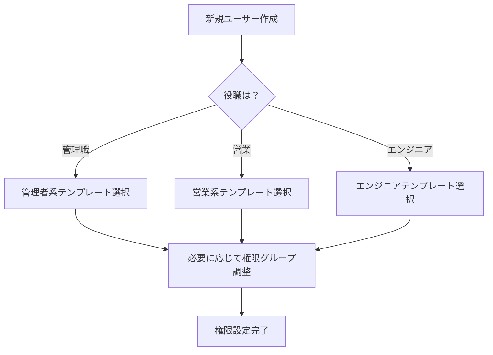

# 権限管理運用設計書

## 1. 概要

### 1.1 本書の目的
本書は、82種類の詳細な権限を実運用において効率的に管理するための、管理インターフェース設計と運用方法を定義する。

### 1.2 課題認識
- 82種類の個別権限を直接管理することは、運用上現実的ではない
- 利用者（管理者）が理解しやすい形での権限管理が必要
- 権限設定ミスによるセキュリティリスクを最小化する必要がある

---

## 2. 権限管理の基本方針

### 2.1 三層構造による管理

```
┌─────────────────────────────────────┐
│        第1層：ロールテンプレート         │  ← 利用者が選択
├─────────────────────────────────────┤
│         第2層：権限グループ             │  ← 必要に応じて調整
├─────────────────────────────────────┤
│         第3層：個別権限（82種類）        │  ← 通常は非表示
└─────────────────────────────────────┘
```

### 2.2 管理の原則
1. **テンプレート優先**：通常はロールテンプレートを選択するだけで運用
2. **カスタマイズ可能**：必要に応じて権限グループ単位で調整
3. **詳細設定**：特殊な要件がある場合のみ個別権限を編集

---

## 3. ロールテンプレート設計

### 3.1 標準ロールテンプレート

#### 3.1.1 SES企業向けテンプレート

| テンプレート名 | 想定利用者 | 含まれる権限グループ |
|---------------|-----------|-------------------|
| **企業管理者セット** | 社長、役員 | 全管理権限、レポート、設定 |
| **営業マネージャーセット** | 営業部長 | 営業活動、エンジニア閲覧、レポート |
| **営業担当者セット** | 営業担当 | 営業活動基本、エンジニア閲覧 |
| **人事管理者セット** | 人事部長 | ユーザー管理、エンジニア管理 |
| **プロジェクトマネージャーセット** | PM | プロジェクト管理、エンジニアアサイン |
| **エンジニアセット** | 技術者 | 自己情報管理のみ |

#### 3.1.2 取引先企業向けテンプレート

| テンプレート名 | 想定利用者 | 含まれる権限グループ |
|---------------|-----------|-------------------|
| **取引先責任者セット** | 部長クラス | エンジニア閲覧、オファー管理 |
| **取引先担当者セット** | 一般社員 | エンジニア閲覧のみ |

### 3.2 権限グループ定義

| グループ名 | 説明 | 含まれる個別権限数 |
|-----------|------|------------------|
| **ユーザー管理** | ユーザーの作成・編集・削除 | 9権限 |
| **エンジニア管理** | エンジニア情報の管理 | 8権限 |
| **営業活動基本** | 取引先管理とアプローチ | 13権限 |
| **営業活動詳細** | オファー管理を含む | 6権限 |
| **プロジェクト管理** | プロジェクトとアサイン | 8権限 |
| **レポート・分析** | 各種レポート機能 | 4権限 |
| **システム設定** | 企業設定・システム設定 | 10権限 |
| **自己情報管理** | 自分の情報のみ | 5権限 |

---

## 4. 管理画面設計

### 4.1 ユーザー権限設定画面

#### 4.1.1 画面構成

```
┌─────────────────────────────────────────────────┐
│ ユーザー権限設定                                   │
├─────────────────────────────────────────────────┤
│ 対象ユーザー: 田中 太郎 (tanaka@example.com)       │
├─────────────────────────────────────────────────┤
│                                                     │
│ 【ステップ1】ロールテンプレート選択                 │
│ ┌─────────────────────────────────┐               │
│ │ ◉ 営業担当者セット（推奨）        │               │
│ │ ○ 営業マネージャーセット         │               │
│ │ ○ カスタム設定                  │               │
│ └─────────────────────────────────┘               │
│                                                     │
│ 【ステップ2】権限グループ調整（オプション）         │
│ ☑ 営業活動基本                                     │
│ ☑ エンジニア閲覧                                  │
│ ☐ プロジェクト管理                                │
│ ☐ レポート・分析                                  │
│                                                     │
│ [詳細設定を表示]                                   │
│                                                     │
│ [キャンセル]                    [権限を設定]        │
└─────────────────────────────────────────────────┤
```

#### 4.1.2 詳細設定モード（通常は非表示）

```
【詳細権限設定】※ 上級者向け
警告：個別権限の変更は予期しない動作を引き起こす可能性があります

▼ エンジニア管理権限
  ☑ engineer:view:company - 自社エンジニア閲覧
  ☐ engineer:view:all - 全エンジニア閲覧
  ☑ engineer:create - エンジニア作成
  ...（82権限すべて表示）
```

### 4.2 権限一覧確認画面

#### 4.2.1 管理者用ダッシュボード

```
┌─────────────────────────────────────────────────┐
│ 権限管理ダッシュボード                             │
├─────────────────────────────────────────────────┤
│                                                     │
│ 【権限割り当て状況】                               │
│ ┌──────────────────────────────┐                 │
│ │ ロール別ユーザー数           │                 │
│ │ 企業管理者:        2名       │                 │
│ │ 営業マネージャー:   3名       │                 │
│ │ 営業担当者:       8名       │                 │
│ │ エンジニア:      45名       │                 │
│ │ カスタム設定:     1名       │                 │
│ └──────────────────────────────┘                 │
│                                                     │
│ 【最近の権限変更】                                 │
│ 2024/08/24 14:30 田中太郎: 営業担当者 → 営業マネージャー │
│ 2024/08/23 10:15 鈴木花子: 新規作成（エンジニア）   │
│                                                     │
│ [ユーザー一覧] [権限テンプレート管理] [監査ログ]     │
└─────────────────────────────────────────────────┤
```

---

## 5. 運用ガイドライン

### 5.1 初期設定フロー



### 5.2 権限変更の承認フロー

| 変更内容 | 承認者 | 備考 |
|---------|--------|------|
| テンプレート内での変更 | 直属上長 | 例：営業担当→営業マネージャー |
| カスタム権限の追加 | 企業管理者 | セキュリティリスク評価必要 |
| システム権限の付与 | スーパー管理者 | 特別な理由書必要 |

### 5.3 定期的な権限レビュー

#### 5.3.1 四半期レビュー
- 全ユーザーの権限設定を確認
- 不要な権限の削除
- 退職者アカウントの確認

#### 5.3.2 権限レビューレポート

```
権限レビューレポート（2024年Q3）
━━━━━━━━━━━━━━━━━━━━━━━━━━━
■ 要確認事項
  ⚠ カスタム権限利用者: 1名
    - 山田次郎: engineer:delete権限を個別付与
      理由：臨時的なデータクリーンアップ作業
      推奨：作業完了後に権限削除

  ⚠ 長期未ログインユーザー: 3名
    - 90日以上ログインなし
    - アカウント無効化を検討

■ 統計情報
  総ユーザー数: 59名
  標準テンプレート利用: 58名 (98.3%)
  カスタム設定: 1名 (1.7%)
```

---

## 6. 実装上の考慮事項

### 6.1 パフォーマンス最適化

#### 6.1.1 権限キャッシュ戦略
```typescript
// 権限情報のキャッシュ（Redis使用）
interface PermissionCache {
  userId: string;
  permissions: string[];
  roleTemplate: string;
  customPermissions: string[];
  ttl: 3600; // 1時間
}
```

#### 6.1.2 権限チェックの効率化
- ロールテンプレートIDでの高速判定
- 頻繁に使用される権限グループの事前計算

### 6.2 監査とコンプライアンス

#### 6.2.1 監査ログ項目
| 記録項目 | 説明 |
|---------|------|
| 変更日時 | タイムスタンプ |
| 変更者 | 実行したユーザー |
| 対象者 | 権限が変更されたユーザー |
| 変更前権限 | テンプレート名または権限リスト |
| 変更後権限 | テンプレート名または権限リスト |
| 変更理由 | 任意入力 |

#### 6.2.2 アラート設定
- 管理者権限の新規付与
- カスタム権限の作成
- 大量の権限変更（10件以上/日）

---

## 7. 移行計画

### 7.1 既存システムからの移行

| フェーズ | 期間 | 作業内容 |
|---------|------|---------|
| Phase 1 | 1週間 | ロールテンプレートの定義 |
| Phase 2 | 2週間 | 管理画面の実装 |
| Phase 3 | 1週間 | 既存ユーザーのマッピング |
| Phase 4 | 1週間 | 並行稼働とテスト |
| Phase 5 | - | 本番切り替え |

### 7.2 ユーザー教育

- 管理者向けトレーニング（2時間）
- 操作マニュアルの作成
- FAQの整備

---

## 8. よくある質問（FAQ）

### Q1: なぜ82個も権限が必要なのか？
**A:** セキュリティとコンプライアンスの要件を満たすため。ただし、通常運用ではテンプレートを使用するため、個別権限を意識する必要はありません。

### Q2: カスタム権限はいつ使うべきか？
**A:** 原則として使用しません。特殊な業務要件がある場合のみ、企業管理者の承認を得て使用します。

### Q3: 権限設定を間違えた場合は？
**A:** 監査ログから変更履歴を確認し、以前の設定に戻すことが可能です。重大な変更は自動的にアラートが発生します。

### Q4: 新しい役職ができた場合は？
**A:** 既存のテンプレートを基に新規テンプレートを作成します。個別権限の組み合わせは避けてください。

---

## 9. 付録

### 9.1 権限グループと個別権限のマッピング表

| 権限グループ | 含まれる個別権限 |
|-------------|----------------|
| **ユーザー管理** | user:view:company, user:create, user:update:company, user:delete, user:manage_role 等 |
| **エンジニア管理** | engineer:view:company, engineer:create, engineer:update:company, engineer:export 等 |
| **営業活動基本** | partner:view:company, partner:create, approach:create, approach:send 等 |
| （以下省略） | |

### 9.2 参考資料
- NIST SP 800-162: Guide to Attribute Based Access Control
- ISO/IEC 27001:2022 情報セキュリティマネジメントシステム

---

**文書管理番号**: CSKS-OPS-AUTH-001  
**機密区分**: 社内限定  
**最終更新日**: 2024年8月24日  
**次回レビュー**: 2024年11月24日